# Project GENESIS Architecture Document

## Introduction

This document outlines the overall project architecture for Project GENESIS, including backend systems, shared services, and non-UI specific concerns. Its primary goal is to serve as the guiding architectural blueprint for AI-driven development, ensuring consistency and adherence to chosen patterns and technologies.

**Relationship to Frontend Architecture:**
If the project includes a significant user interface, a separate Frontend Architecture Document will detail the frontend-specific design and MUST be used in conjunction with this document. Core technology stack choices documented herein (see "Tech Stack") are definitive for the entire project, including any frontend components.

### Starter Template or Existing Project

No existing trading frameworks (Freqtrade, Jesse, etc.) will be used - they would constrain the tier-locking mechanism and psychological safeguards that are core to GENESIS's survival strategy. Building from scratch with:
- ccxt for Binance API abstraction
- Rich/Textual for the terminal UI  
- asyncio as the core async framework
- Custom tier-locking state machine, tilt detection, and risk management

### Change Log

| Date | Version | Description | Author |
|------|---------|-------------|--------|
| 2025-08-23 | 1.0 | Initial architecture document creation | Winston (Architect) |

## High Level Architecture

### Technical Summary

Project GENESIS is an event-driven, monolithic-to-microservices cryptocurrency trading system that evolves with capital growth. Built on Python's asyncio framework, it implements a tier-locked state machine that physically prevents destructive behaviors by enforcing execution strategies appropriate to account size. The architecture uses domain-driven design with clear module boundaries, enabling the planned migration from SQLite to PostgreSQL to Rust components without major rewrites. Core patterns include event sourcing for audit trails, repository pattern for data abstraction, and command pattern for order execution, all orchestrated through a central event bus that enables real-time psychological monitoring and intervention.

### High Level Overview

1. **Architectural Style**: **Evolutionary Monolith** - Starting as a well-structured monolith with clear domain boundaries, designed to decompose into services as capital grows. This isn't a traditional monolith but a "modular monolith" with service-oriented internal architecture.

2. **Repository Structure**: **Monorepo** - All components in a single repository with clear modular separation (/engine, /strategies, /risk, /tilt, /analytics, /infrastructure). This supports atomic tier transitions and prevents version mismatches during critical evolution points.

3. **Service Architecture**: 
   - **Phase 1 ($500-$2k)**: Single Python process with asyncio
   - **Phase 2 ($2k-$10k)**: Modular monolith with hot-swappable strategies
   - **Phase 3 ($10k+)**: Service-oriented with Rust execution engine

4. **Primary Data Flow**: Market Data → Event Bus → Strategy Engine → Risk Validation → Tilt Check → Order Execution → Position Management → Analytics Pipeline

5. **Key Architectural Decisions**:
   - Event-driven architecture for loose coupling and real-time monitoring
   - Repository pattern to abstract database transitions (SQLite → PostgreSQL)
   - State machine pattern for tier management (prevents manual override)
   - Command/Query separation for order execution vs analytics
   - Circuit breaker pattern for API resilience

### High Level Project Diagram


### Architectural and Design Patterns

- **Event-Driven Architecture:** Using asyncio event loops with publish-subscribe pattern via internal event bus - *Rationale:* Enables real-time tilt detection, loose coupling between components, and audit trail generation without impacting execution latency

- **Repository Pattern:** Abstract data access layer wrapping SQLite/PostgreSQL/Redis operations - *Rationale:* Allows seamless database migration at tier transitions without changing business logic, critical for $2k SQLite→PostgreSQL evolution

- **State Machine Pattern:** Tier-locked finite state machine controlling feature availability - *Rationale:* Physically prevents access to dangerous features before psychological readiness, enforcing discipline through code

- **Command Pattern:** Encapsulated order objects with validation, execution, and rollback - *Rationale:* Enables order queuing, slicing algorithms, and comprehensive audit trail for every trading decision

- **Circuit Breaker Pattern:** API call wrapper with failure detection and automatic recovery - *Rationale:* Prevents cascade failures during Binance outages, essential for 99.5% uptime requirement

- **Domain-Driven Design:** Bounded contexts for Risk, Trading, Psychology, Analytics domains - *Rationale:* Clear module boundaries enable component replacement during Rust migration without system-wide refactoring

- **Event Sourcing:** All state changes recorded as events for reconstruction - *Rationale:* Provides complete audit trail for forensic analysis, tilt pattern detection, and recovery from crashes

- **CQRS Lite:** Separate paths for order execution (commands) vs analytics (queries) - *Rationale:* Optimizes <100ms execution path while enabling complex analytics without performance impact

## Tech Stack

This is the DEFINITIVE technology selection for Project GENESIS. Every choice here directly impacts our ability to survive the valley of death and reach $100k. These decisions are final and all other documentation must reference these exact versions.

### Cloud Infrastructure

- **Provider:** DigitalOcean
- **Key Services:** Droplets (Ubuntu 22.04 LTS), Spaces (S3-compatible backup)
- **Deployment Regions:** Singapore (SGP1 - primary, closest to Binance)

### Technology Stack Table - PHASED APPROACH

| Category | Technology | Version | Phase | Purpose | Rationale |
|----------|------------|---------|-------|---------|-----------|
| **Language** | Python | 3.11.8 | MVP | Primary development language | Asyncio maturity, sufficient speed with proper architecture |
| **Runtime** | CPython | 3.11.8 | MVP | Python interpreter | Standard, stable, well-tested with asyncio |
| **Async Framework** | asyncio | stdlib | MVP | Concurrent I/O operations | Native Python, no extra dependencies |
| **Exchange Library** | ccxt | 4.2.25 | MVP | Binance API abstraction | Battle-tested, handles rate limits, automatic retry logic |
| **Terminal UI** | Rich | 13.7.0 | MVP | Terminal interface rendering | Beautiful TUI for "Digital Zen Garden" aesthetic |
| **Terminal Framework** | Textual | 0.47.1 | MVP | Interactive TUI framework | Event-driven UI, reactive updates without flicker |
| **Database** | SQLite | 3.45.0 | MVP | Trade logging, state persistence | Zero-config, atomic transactions, single file backup |
| **Database** | PostgreSQL | 16.1 | $2k+ | Scalable data storage | Time-series optimization, concurrent access |
| **Cache/Queue** | Python dicts + asyncio.Queue | stdlib | MVP | In-memory state and queuing | Zero additional complexity, sufficient for single-pair trading |
| **Cache/Queue** | Redis | 7.2.4 | $2k+ | Distributed state, order queuing | <1ms latency when multi-pair trading requires it |
| **Decimal Math** | decimal | stdlib | MVP | Financial calculations | Prevents float rounding errors in position sizing |
| **Data Analysis** | pandas | 2.2.0 | MVP | Statistical calculations | Required for spread analysis and arbitrage detection |
| **Numerical Computing** | numpy | 1.26.3 | MVP | Array operations | Correlation matrices, fast calculations |
| **HTTP Client** | aiohttp | 3.9.3 | MVP | Async HTTP for REST API | Connection pooling, timeout handling |
| **WebSocket Client** | websockets | 12.0 | MVP | Market data streams | Pure Python, asyncio native |
| **Configuration** | pydantic | 2.5.3 | MVP | Config validation | Runtime validation, environment variable parsing |
| **Logging** | structlog | 24.1.0 | MVP | Structured logging | JSON output for forensic analysis |
| **Schema Migrations** | Alembic | 1.13.1 | MVP | Database migrations | Critical for SQLite→PostgreSQL transition |
| **Backup Tool** | restic | 0.16.3 | MVP | Encrypted backups | Automated backups to DigitalOcean Spaces |
| **Testing** | pytest | 8.0.0 | MVP | Test framework | Async test support, fixtures |
| **Test Coverage** | pytest-cov | 4.1.0 | MVP | Coverage reporting | Ensures critical paths tested |
| **Code Formatting** | black | 24.1.1 | MVP | Code style enforcement | Consistent formatting |
| **Linting** | ruff | 0.1.14 | MVP | Fast Python linter | 10-100x faster than pylint |
| **Type Checking** | mypy | 1.8.0 | MVP | Static type checking | Catch errors before runtime |
| **Process Manager** | supervisor | 4.2.5 | MVP | Process monitoring/restart | Automatic recovery from crashes |
| **Monitoring** | Log files + alerts | N/A | MVP | Basic monitoring | Parse logs for critical errors, email alerts |
| **Monitoring** | Prometheus | 2.48.1 | $5k+ | Metrics collection | When capital justifies infrastructure |
| **Visualization** | Grafana | 10.3.1 | $5k+ | Metrics dashboards | When worth the complexity |
| **Message Format** | JSON | stdlib | MVP | Serialization | Simple, debuggable, sufficient |
| **Message Format** | MessagePack | 1.0.7 | $10k+ | Binary serialization | When microseconds matter |
| **Container** | Docker | 25.0.0 | MVP | Deployment consistency | Identical dev/prod environments |
| **IaC** | Bash scripts | N/A | MVP | Simple deployment | Reduce complexity at start |
| **IaC** | Terraform | 1.7.0 | $2k+ | Infrastructure automation | When managing multiple servers |
| **VPN** | SSH + tmux | N/A | MVP | Remote access | Simple, secure, no additional services |
| **VPN** | Tailscale | 1.56.1 | $5k+ | Team access | When backup operator needed |
| **Version Control** | Git | 2.43.0 | MVP | Source control | Critical from day one |
| **CI/CD** | GitHub Actions | N/A | MVP | Automated testing | Free tier, test before deploy |

### Phased Technology Evolution

**Phase 1: MVP ($500-$2k)**
- Pure Python with asyncio - no external state management
- SQLite with Alembic for future migration path
- In-memory everything (dicts, queues, calculations)
- Structured logging to files with log rotation
- Automated backups every 4 hours with restic

**Phase 2: Hunter ($2k-$10k)**
- Add Redis for multi-pair state management
- Migrate to PostgreSQL (via Alembic migrations)
- Keep JSON serialization (it's working)
- Basic monitoring with log aggregation

**Phase 3: Strategist ($10k+)**
- Consider Rust for execution engine
- Add Prometheus/Grafana for observability
- MessagePack if event volume demands it
- Full infrastructure automation with Terraform

## Data Models

The data models represent the heart of GENESIS's domain logic. Each model enforces business rules that prevent emotional trading and ensure tier-appropriate behavior.

### Account
**Purpose:** Tracks current capital, tier status, and progression gates

**Key Attributes:**
- account_id: UUID - Unique identifier
- balance: Decimal - Current total capital (USDT)
- tier: Enum[SNIPER|HUNTER|STRATEGIST|ARCHITECT] - Current tier (locked by state machine)
- tier_started_at: DateTime - When entered current tier
- gates_passed: JSON - Array of passed gate requirements
- locked_features: JSON - Features disabled at current tier
- created_at: DateTime - Account creation timestamp

**Relationships:**
- Has many Positions
- Has many TradingSession
- Has one TiltProfile

### Position
**Purpose:** Represents an active or historical trading position

**Key Attributes:**
- position_id: UUID - Unique identifier
- account_id: UUID - Link to Account
- symbol: String - Trading pair (e.g., "BTC/USDT")
- side: Enum[LONG|SHORT] - Position direction
- entry_price: Decimal - Average entry price
- current_price: Decimal - Latest market price
- quantity: Decimal - Position size in base currency
- dollar_value: Decimal - Position value in USDT
- stop_loss: Decimal - Stop loss price
- pnl_dollars: Decimal - Unrealized P&L in dollars
- pnl_percent: Decimal - Unrealized P&L percentage
- opened_at: DateTime - Position open time
- closed_at: DateTime - Position close time (null if open)
- close_reason: String - Why position closed (stop_loss|take_profit|manual|tilt_intervention)

**Relationships:**
- Belongs to Account
- Has many Orders
- Has many TiltEvents (interventions on this position)

### Order
**Purpose:** Individual order execution record with slicing support

**Key Attributes:**
- order_id: UUID - Unique identifier  
- position_id: UUID - Parent position
- exchange_order_id: String - Binance order ID
- type: Enum[MARKET|LIMIT|STOP_LOSS] - Order type
- side: Enum[BUY|SELL] - Order side
- price: Decimal - Execution price (null for market)
- quantity: Decimal - Order quantity
- filled_quantity: Decimal - Actually filled amount
- status: Enum[PENDING|PARTIAL|FILLED|CANCELLED] - Current status
- slice_number: Integer - Which slice (1 of N) for iceberg orders
- total_slices: Integer - Total slices for this execution
- latency_ms: Integer - Execution latency
- slippage_percent: Decimal - Difference from expected price
- created_at: DateTime - Order creation
- executed_at: DateTime - Actual execution time

**Relationships:**
- Belongs to Position
- Has many ExecutionEvents

### TiltProfile  
**Purpose:** Tracks behavioral baseline and current psychological state

**Key Attributes:**
- profile_id: UUID - Unique identifier
- account_id: UUID - Link to Account
- baseline_trades_per_hour: Decimal - Normal trading frequency
- baseline_click_latency_ms: Integer - Normal decision speed
- baseline_cancel_rate: Decimal - Normal order cancellation rate
- current_tilt_score: Integer - Current tilt level (0-100)
- tilt_level: Enum[NORMAL|CAUTION|WARNING|LOCKED] - Intervention level
- consecutive_losses: Integer - Loss streak counter
- last_intervention_at: DateTime - Last tilt intervention
- recovery_required: Boolean - Whether recovery protocol active
- journal_entries_required: Integer - Outstanding journal entries

**Relationships:**
- Belongs to Account
- Has many TiltEvents
- Has many BehavioralMetrics

### TiltEvent
**Purpose:** Records psychological interventions and their triggers

**Key Attributes:**
- event_id: UUID - Unique identifier
- profile_id: UUID - Link to TiltProfile
- position_id: UUID - Related position (if applicable)
- event_type: String - Type of intervention
- tilt_indicators: JSON - Array of triggered indicators
- tilt_score_before: Integer - Score before intervention
- tilt_score_after: Integer - Score after intervention
- intervention_message: Text - Message shown to trader
- trader_response: Text - How trader responded
- created_at: DateTime - Event timestamp

**Relationships:**
- Belongs to TiltProfile
- May belong to Position

### MarketState
**Purpose:** Tracks market regime and conditions

**Key Attributes:**
- state_id: UUID - Unique identifier
- symbol: String - Trading pair
- state: Enum[DEAD|NORMAL|VOLATILE|PANIC|MAINTENANCE] - Current classification
- volatility_atr: Decimal - ATR-based volatility
- spread_basis_points: Integer - Current spread in bps
- volume_24h: Decimal - 24-hour volume
- liquidity_score: Decimal - Depth-based liquidity metric
- detected_at: DateTime - When state detected
- state_duration_seconds: Integer - How long in this state

**Relationships:**
- Has many Positions (opened during this state)
- Has many MarketEvents

### TradingSession
**Purpose:** Groups trades within a session for analysis

**Key Attributes:**
- session_id: UUID - Unique identifier
- account_id: UUID - Link to Account
- started_at: DateTime - Session start
- ended_at: DateTime - Session end
- starting_balance: Decimal - Balance at start
- ending_balance: Decimal - Balance at end
- total_trades: Integer - Number of trades
- winning_trades: Integer - Profitable trades
- losing_trades: Integer - Loss-making trades
- max_drawdown: Decimal - Largest drawdown in session
- tilt_events_count: Integer - Number of interventions
- session_type: Enum[NORMAL|RECOVERY|PAPER] - Session context

**Relationships:**
- Belongs to Account
- Has many Positions
- Has many TiltEvents

### Event (Audit Trail)
**Purpose:** Immutable event log for event sourcing and forensic analysis

**Key Attributes:**
- event_id: UUID - Unique identifier
- event_type: String - Event name (e.g., "OrderPlaced", "TiltDetected", "TierTransition")
- aggregate_id: UUID - ID of affected entity
- aggregate_type: String - Type of entity (Account, Position, etc.)
- event_data: JSON - Full event payload
- event_metadata: JSON - Context (user action, system trigger, etc.)
- created_at: DateTime - Event timestamp (immutable)
- sequence_number: BigInt - Global sequence for ordering

**Relationships:**
- Polymorphic - can relate to any entity
- Never updated, only inserted

### PositionCorrelation
**Purpose:** Tracks correlation between active positions for risk management

**Key Attributes:**
- correlation_id: UUID - Unique identifier
- position_1_id: UUID - First position
- position_2_id: UUID - Second position
- correlation_coefficient: Decimal - Current correlation (-1 to 1)
- calculation_window: Integer - Minutes used for calculation
- last_calculated: DateTime - When last updated
- alert_triggered: Boolean - Whether >60% threshold hit

**Relationships:**
- References two Positions
- Belongs to TradingSession

### GlobalMarketState
**Purpose:** Overall market regime affecting all trading

**Key Attributes:**
- state_id: UUID - Unique identifier
- btc_price: Decimal - Bitcoin price (market leader)
- total_market_cap: Decimal - Overall crypto market cap
- fear_greed_index: Integer - Market sentiment (0-100)
- correlation_spike: Boolean - Whether correlations >80%
- state: Enum[BULL|BEAR|CRAB|CRASH|RECOVERY] - Market regime
- vix_crypto: Decimal - Crypto volatility index
- detected_at: DateTime - When state detected

**Relationships:**
- Has many MarketStates (per-symbol states during this regime)
- Has many Positions (opened during this regime)

### SchemaVersion
**Purpose:** Track database migrations for SQLite→PostgreSQL transition

**Key Attributes:**
- version_id: Integer - Sequential version number
- migration_name: String - Descriptive name
- applied_at: DateTime - When migration ran
- checksum: String - Migration file hash
- rollback_sql: Text - SQL to reverse this migration

**Relationships:**
- Standalone migration tracking

## Components

Based on our architecture, data models, and tier enforcement requirements, here are the major system components:

### Event Bus (Core Infrastructure)
**Responsibility:** Central nervous system for all component communication with priority lanes for execution events

**Key Interfaces:**
- `publish(event: Event, priority: Priority) -> None` - Emit events with HIGH (execution) or NORMAL (analytics) priority
- `subscribe(event_type: str, handler: Callable, priority: Priority) -> None` - Register handlers with priority
- `get_event_history(aggregate_id: UUID, limit: int) -> List[Event]` - Replay events for recovery

**Dependencies:** None (foundational component)

**Technology Stack:** Pure Python asyncio with priority queues, upgrades to Redis pub/sub at $2k

### Tier State Machine
**Responsibility:** Physical enforcement of tier restrictions and progression/demotion logic

**Key Interfaces:**
- `check_tier_requirement(required: Tier) -> bool` - Gate check for features
- `evaluate_progression() -> TierTransition` - Check if gates passed for upgrade
- `force_demotion(reason: str) -> None` - Emergency tier downgrade
- `get_available_features() -> List[str]` - What's unlocked at current tier

**Dependencies:** Account repository, Event Bus

**Technology Stack:** Python state machine with decorators, persistent state in SQLite

### Risk Engine
**Responsibility:** Position sizing, risk limit enforcement, and portfolio-level risk management

**Key Interfaces:**
- `calculate_position_size(balance: Decimal, risk_percent: Decimal) -> Decimal` - Safe position sizing
- `check_risk_limits(position: Position) -> RiskDecision` - Approve/reject trades
- `calculate_portfolio_risk() -> PortfolioRisk` - Overall exposure metrics
- `get_correlation_matrix() -> np.array` - Current position correlations

**Dependencies:** Position repository, Market Data Service, Event Bus

**Technology Stack:** Python with numpy for calculations, decimal for precision

### Tilt Detector
**Responsibility:** Real-time behavioral monitoring and psychological intervention

**Key Interfaces:**
- `update_metrics(action: UserAction) -> TiltScore` - Process user behavior
- `check_intervention_required() -> Intervention` - Determine if action needed
- `enforce_intervention(level: TiltLevel) -> None` - Lock trading, require journal, etc.
- `calculate_baseline() -> BehavioralBaseline` - Learn normal patterns

**Dependencies:** TiltProfile repository, Event Bus, UI Controller

**Technology Stack:** Python with scipy for statistical analysis, rolling window calculations

### Order Executor
**Responsibility:** Order placement, execution algorithms (market/iceberg/TWAP), and slicing logic

**Key Interfaces:**
- `execute_market_order(order: Order) -> ExecutionResult` - Simple market execution
- `execute_iceberg_order(order: Order, slices: int) -> ExecutionResult` - Sliced execution
- `execute_twap(order: Order, duration: int) -> ExecutionResult` - Time-weighted execution
- `cancel_all_orders() -> None` - Emergency stop

**Dependencies:** Exchange Gateway, Risk Engine, Tier State Machine

**Technology Stack:** Python asyncio, ccxt for exchange interaction

### Exchange Gateway
**Responsibility:** All Binance API interaction, connection management, and rate limiting

**Key Interfaces:**
- `place_order(order: Order) -> ExchangeOrder` - Submit to Binance
- `cancel_order(order_id: str) -> None` - Cancel existing order
- `get_balance() -> Balance` - Account balance
- `subscribe_market_data(symbol: str) -> AsyncIterator[Tick]` - Real-time prices

**Dependencies:** None (external boundary)

**Technology Stack:** ccxt, websockets, aiohttp with circuit breaker pattern

### Market Data Service
**Responsibility:** Real-time price feeds, order book management, and market state classification

**Key Interfaces:**
- `get_current_price(symbol: str) -> Decimal` - Latest price
- `get_order_book(symbol: str, depth: int) -> OrderBook` - Current depth
- `classify_market_state(symbol: str) -> MarketState` - Regime detection
- `calculate_spread(symbol: str) -> Decimal` - Current spread in bps

**Dependencies:** Exchange Gateway, Event Bus

**Technology Stack:** Python asyncio, websockets for streaming, pandas for analysis

### Strategy Engine
**Responsibility:** Strategy selection, signal generation, and trading logic orchestration

**Key Interfaces:**
- `load_strategies(tier: Tier) -> List[Strategy]` - Load tier-appropriate strategies
- `generate_signals() -> List[Signal]` - Check for trading opportunities
- `rank_opportunities(signals: List[Signal]) -> List[Signal]` - Prioritize trades
- `execute_strategy(signal: Signal) -> Position` - Act on signal

**Dependencies:** Market Data Service, Order Executor, Risk Engine

**Technology Stack:** Python with pluggable strategy modules, pandas/numpy for calculations

### Analytics Engine
**Responsibility:** Performance tracking, reporting, and forensic analysis

**Key Interfaces:**
- `calculate_performance_metrics() -> PerformanceReport` - Win rate, Sharpe, etc.
- `generate_session_report(session_id: UUID) -> SessionReport` - Trading session analysis
- `analyze_tilt_correlation() -> TiltImpact` - Behavior vs performance
- `export_for_taxes() -> CSV` - Trade history export

**Dependencies:** All repositories, Event Bus (subscriber only)

**Technology Stack:** Python with pandas for analysis, structlog for forensics

### Terminal UI Controller
**Responsibility:** Render "Digital Zen Garden" interface, handle commands, display real-time data

**Key Interfaces:**
- `render_dashboard() -> None` - Update terminal display
- `process_command(cmd: str) -> CommandResult` - Parse and execute user input
- `show_intervention(message: str, level: TiltLevel) -> None` - Display tilt warnings
- `update_tier_progress() -> None` - Show gate completion status

**Dependencies:** All other components (UI is the integration point)

**Technology Stack:** Rich for rendering, Textual for interaction, asyncio for real-time updates

### Data Repository Layer
**Responsibility:** Abstract database operations for migration path

**Key Interfaces:**
- `save(entity: Entity) -> None` - Persist any domain object
- `find_by_id(entity_type: Type, id: UUID) -> Entity` - Retrieve by ID
- `query(criteria: QueryCriteria) -> List[Entity]` - Complex queries
- `migrate_to_postgres() -> None` - One-command migration at $2k

**Dependencies:** Database connections (SQLite/PostgreSQL)

**Technology Stack:** Python with SQLAlchemy core (not ORM), Alembic for migrations

### Component Interaction Diagram


## External APIs

Project GENESIS requires integration with Binance's API suite for market data and order execution. The connection resilience and retry logic are critical - a dropped connection during execution could mean the difference between profit and account destruction.

### Binance Spot Trading API
- **Purpose:** Execute spot trades, manage orders, query account balance
- **Documentation:** https://binance-docs.github.io/apidocs/spot/en/
- **Base URL(s):** 
  - REST: https://api.binance.com
  - WebSocket Streams: wss://stream.binance.com:9443
- **Authentication:** HMAC SHA256 signature with API key/secret
- **Rate Limits:** 
  - 1200 requests per minute (weight-based)
  - 50 orders per 10 seconds
  - 160,000 orders per day

**Key Endpoints Used:**
- `GET /api/v3/account` - Account balance and status
- `POST /api/v3/order` - Place new order
- `DELETE /api/v3/order` - Cancel order
- `GET /api/v3/order` - Query order status
- `GET /api/v3/depth` - Order book depth
- `GET /api/v3/klines` - Historical candlestick data
- `GET /api/v3/ticker/24hr` - 24hr price statistics

**Integration Notes:** 
- Use ccxt library's built-in rate limit handling
- Implement circuit breaker with exponential backoff (2^n seconds, max 60s)
- Maintain 3 WebSocket connections with automatic failover
- Track weight consumption, stay below 80% capacity
- Use `recvWindow` of 5000ms for time synchronization tolerance

### Binance WebSocket Streams API
- **Purpose:** Real-time market data feeds for price and order book updates
- **Documentation:** https://binance-docs.github.io/apidocs/spot/en/#websocket-market-streams
- **Base URL(s):** 
  - Public: wss://stream.binance.com:9443/ws
  - Combined: wss://stream.binance.com:9443/stream
- **Authentication:** None required for public market data
- **Rate Limits:** 
  - 5 connections per IP
  - 24 hour connection limit before forced disconnect

**Key Endpoints Used:**
- `/ws/<symbol>@trade` - Real-time trade executions
- `/ws/<symbol>@depth20@100ms` - Order book updates (20 levels, 100ms frequency)
- `/ws/<symbol>@kline_1m` - 1-minute candlestick updates
- `/ws/<symbol>@ticker` - 24hr rolling window ticker
- `/stream?streams=` - Combined streams for multiple symbols

**Integration Notes:**
- Implement heartbeat/pong every 30 seconds to keep connection alive
- Auto-reconnect with exponential backoff on disconnect
- Buffer missed messages during reconnection using REST API catchup
- Maintain separate connections for critical pairs vs monitoring pairs
- Use connection pooling: 1 for execution pairs, 1 for monitoring, 1 for backup

### Binance System Status API
- **Purpose:** Monitor exchange health and maintenance windows
- **Documentation:** https://binance-docs.github.io/apidocs/spot/en/#system-status-system
- **Base URL(s):** https://api.binance.com
- **Authentication:** None required
- **Rate Limits:** 1 request per second

**Key Endpoints Used:**
- `GET /sapi/v1/system/status` - System maintenance status
- `GET /api/v3/ping` - Test connectivity
- `GET /api/v3/time` - Server time for synchronization
- `GET /api/v3/exchangeInfo` - Trading rules and symbol information

**Integration Notes:**
- Check system status before market open
- Use server time to sync local clock (critical for signatures)
- Cache exchangeInfo for 24 hours (trading rules rarely change)
- If maintenance detected, enter MarketState.MAINTENANCE automatically

## Core Workflows

These sequence diagrams illustrate the critical system workflows, showing how components interact without tight coupling through the Event Bus.

### Order Execution Flow (Sniper Tier - Simple Market Order)

```mermaid
sequenceDiagram
    participant User
    participant TUI as Terminal UI
    participant CMD as Command Parser
    participant TSM as Tier State Machine
    participant RE as Risk Engine
    participant TD as Tilt Detector
    participant OE as Order Executor
    participant EG as Exchange Gateway
    participant EB as Event Bus
    participant DB as Database

    User->>TUI: "buy 100 usdt btc"
    TUI->>CMD: Parse command
    CMD->>TSM: Check tier permissions
    TSM-->>CMD: SNIPER tier, market orders allowed
    
    CMD->>RE: Calculate position size
    RE->>DB: Get account balance
    DB-->>RE: $500 balance
    RE-->>CMD: Position size: $25 (5% rule)
    
    CMD->>TD: Check tilt status
    TD-->>CMD: Tilt score: 15 (NORMAL)
    
    CMD->>OE: Execute market order
    OE->>EG: Place order on Binance
    
    Note over EG: Circuit breaker checks
    EG->>Binance: POST /api/v3/order
    Binance-->>EG: Order filled @ $67,453
    
    EG-->>OE: Execution result
    OE->>EB: Publish OrderExecuted event (HIGH priority)
    OE->>DB: Save order and position
    
    EB-->>TD: Update behavioral metrics
    EB-->>Analytics: Record for analysis (NORMAL priority)
    
    OE-->>TUI: Display confirmation
    TUI-->>User: "✓ Bought 0.00037 BTC @ $67,453"
```



### Tilt Detection and Intervention Flow

```mermaid
sequenceDiagram
    participant User
    participant TUI as Terminal UI
    participant TD as Tilt Detector
    participant TSM as Tier State Machine
    participant EB as Event Bus
    participant DB as Database

    loop Every user action
        User->>TUI: Rapid clicking/typing
        TUI->>EB: Publish UserAction event
        EB->>TD: Process behavioral data
        TD->>TD: Calculate deviation from baseline
    end

    Note over TD: Multiple indicators triggered
    TD->>DB: Get TiltProfile
    DB-->>TD: Baseline metrics
    
    TD->>TD: Tilt score: 65 (WARNING)
    TD->>EB: Publish TiltDetected event
    
    EB->>TSM: Tilt intervention required
    TSM->>TSM: Lock trading features
    TSM->>TUI: Display intervention
    
    TUI-->>User: "🟧 Trading paused - Performance optimization needed"
    TUI-->>User: "Write 500 words about your emotional state to continue"
    
    User->>TUI: Journal entry
    TUI->>TD: Process recovery
    TD->>DB: Save journal entry
    TD->>TSM: Clear intervention
    TSM->>TSM: Unlock with 50% position limits
    TSM->>TUI: Update status
    TUI-->>User: "Trading resumed - Position sizes limited for 1 hour"
```



### Tier Transition Flow ($2k Sniper → Hunter)

```mermaid
sequenceDiagram
    participant System
    participant TSM as Tier State Machine
    participant DB as Database
    participant RE as Risk Engine
    participant EB as Event Bus
    participant TUI as Terminal UI
    participant User

    System->>TSM: Daily tier evaluation
    TSM->>DB: Check gate requirements
    DB-->>TSM: Account balance: $2,150
    DB-->>TSM: 30 days at tier: ✓
    DB-->>TSM: 60% profitable days: ✓
    DB-->>TSM: No position violations: ✓
    DB-->>TSM: 90% execution speed: ✓
    
    TSM->>TSM: All gates passed
    TSM->>EB: Publish TierTransition event
    
    EB->>DB: Update account tier
    EB->>RE: Update risk parameters
    EB->>TUI: Trigger ceremony
    
    TUI-->>User: "🎯 TIER ADVANCEMENT READY"
    TUI-->>User: "You've earned Hunter tier capabilities"
    TUI-->>User: "New features: Order slicing, Multi-pair trading"
    TUI-->>User: "Type 'I understand the responsibilities' to proceed"
    
    User->>TUI: Confirmation
    
    TSM->>TSM: Activate Hunter features
    TSM->>DB: Log tier transition
    
    Note over TSM: 48-hour adjustment period begins
    TSM->>RE: Set conservative limits for 48h
```



### Iceberg Order Execution (Hunter Tier)

```mermaid
sequenceDiagram
    participant CMD as Command Parser
    participant TSM as Tier State Machine
    participant OE as Order Executor
    participant EG as Exchange Gateway
    participant MDS as Market Data Service
    participant EB as Event Bus

    CMD->>TSM: Request iceberg execution
    TSM-->>CMD: HUNTER tier, slicing allowed
    
    CMD->>OE: Execute iceberg ($300 total)
    OE->>MDS: Get order book depth
    MDS-->>OE: Liquidity analysis
    
    OE->>OE: Calculate slices (3x $100)
    
    loop For each slice
        Note over OE: Random delay 1-5 seconds
        OE->>OE: Wait random interval
        OE->>OE: Vary size ±20% ($80-120)
        
        OE->>EG: Place limit order
        EG->>Binance: POST /api/v3/order
        Binance-->>EG: Slice filled
        EG-->>OE: Confirmation
        
        OE->>EB: Publish SliceExecuted event
        
        OE->>MDS: Check market impact
        MDS-->>OE: Price moved 0.2%
        
        alt Price impact > 0.5%
            OE->>OE: Abort remaining slices
            OE->>EB: Publish IcebergAborted event
        end
    end
    
    OE->>EB: Publish IcebergComplete event
    OE-->>CMD: Execution complete
```



### Emergency Demotion Flow


## REST API Spec

While GENESIS is primarily a terminal-based system, we need internal REST APIs for monitoring, testing, and emergency control. These APIs are NOT exposed publicly - they're only accessible via SSH tunnel or VPN.

```yaml
openapi: 3.0.0
info:
  title: GENESIS Internal Control API
  version: 1.0.0
  description: Internal API for monitoring and emergency control. NOT PUBLIC - VPN access only.
servers:
  - url: http://localhost:8080
    description: Local access only (via SSH tunnel)
  - url: http://10.0.0.2:8080
    description: Private VPC access (Tailscale VPN required at $5k+)

security:
  - ApiKeyAuth: []

paths:
  /health:
    get:
      summary: System health check
      operationId: getHealth
      responses:
        '200':
          description: System healthy
          content:
            application/json:
              schema:
                $ref: '#/components/schemas/HealthStatus'
        '503':
          description: System unhealthy

  /account/status:
    get:
      summary: Get current account status and tier
      operationId: getAccountStatus
      responses:
        '200':
          description: Account information
          content:
            application/json:
              schema:
                $ref: '#/components/schemas/AccountStatus'

  /positions:
    get:
      summary: List all positions (open and closed)
      operationId: getPositions
      parameters:
        - name: status
          in: query
          schema:
            type: string
            enum: [open, closed, all]
          default: open
      responses:
        '200':
          description: Position list
          content:
            application/json:
              schema:
                type: array
                items:
                  $ref: '#/components/schemas/Position'

  /emergency/halt:
    post:
      summary: Emergency trading halt
      operationId: emergencyHalt
      requestBody:
        required: true
        content:
          application/json:
            schema:
              type: object
              required:
                - reason
                - confirmation
              properties:
                reason:
                  type: string
                  minLength: 10
                confirmation:
                  type: string
                  pattern: '^HALT TRADING NOW$'
      responses:
        '200':
          description: Trading halted
        '400':
          description: Invalid confirmation

  /emergency/close-all:
    post:
      summary: Close all positions immediately
      operationId: closeAllPositions
      requestBody:
        required: true
        content:
          application/json:
            schema:
              type: object
              required:
                - confirmation
              properties:
                confirmation:
                  type: string
                  pattern: '^CLOSE ALL POSITIONS$'
                max_slippage_percent:
                  type: number
                  default: 1.0
      responses:
        '200':
          description: Positions closed
          content:
            application/json:
              schema:
                $ref: '#/components/schemas/CloseAllResult'

  /tilt/status:
    get:
      summary: Get current tilt detection status
      operationId: getTiltStatus
      responses:
        '200':
          description: Tilt information
          content:
            application/json:
              schema:
                $ref: '#/components/schemas/TiltStatus'

  /tilt/override:
    post:
      summary: Override tilt intervention (dangerous)
      operationId: overrideTilt
      requestBody:
        required: true
        content:
          application/json:
            schema:
              type: object
              required:
                - journal_entry
                - confirmation
              properties:
                journal_entry:
                  type: string
                  minLength: 500
                confirmation:
                  type: string
                  pattern: '^I ACCEPT THE RISKS$'
      responses:
        '200':
          description: Tilt override accepted
        '423':
          description: Override locked (too many attempts)

  /config/tier:
    get:
      summary: Get tier configuration and gates
      operationId: getTierConfig
      responses:
        '200':
          description: Tier configuration
          content:
            application/json:
              schema:
                $ref: '#/components/schemas/TierConfig'

  /analytics/performance:
    get:
      summary: Get performance metrics
      operationId: getPerformance
      parameters:
        - name: period
          in: query
          schema:
            type: string
            enum: [day, week, month, all]
          default: day
      responses:
        '200':
          description: Performance metrics
          content:
            application/json:
              schema:
                $ref: '#/components/schemas/PerformanceMetrics'

  /system/events:
    get:
      summary: Get recent system events (audit trail)
      operationId: getEvents
      parameters:
        - name: limit
          in: query
          schema:
            type: integer
            default: 100
            maximum: 1000
        - name: after
          in: query
          schema:
            type: string
            format: date-time
      responses:
        '200':
          description: Event list
          content:
            application/json:
              schema:
                type: array
                items:
                  $ref: '#/components/schemas/Event'

components:
  securitySchemes:
    ApiKeyAuth:
      type: apiKey
      in: header
      name: X-API-Key

  schemas:
    HealthStatus:
      type: object
      required:
        - status
        - uptime_seconds
        - components
      properties:
        status:
          type: string
          enum: [healthy, degraded, unhealthy]
        uptime_seconds:
          type: integer
        components:
          type: object
          properties:
            exchange_gateway:
              type: string
            event_bus:
              type: string
            database:
              type: string
            websocket_streams:
              type: string

    AccountStatus:
      type: object
      required:
        - account_id
        - balance
        - tier
        - tier_started_at
      properties:
        account_id:
          type: string
          format: uuid
        balance:
          type: string
          format: decimal
        tier:
          type: string
          enum: [SNIPER, HUNTER, STRATEGIST, ARCHITECT]
        tier_started_at:
          type: string
          format: date-time
        gates_passed:
          type: array
          items:
            type: string
        locked_features:
          type: array
          items:
            type: string

    Position:
      type: object
      required:
        - position_id
        - symbol
        - side
        - entry_price
        - quantity
        - pnl_dollars
      properties:
        position_id:
          type: string
          format: uuid
        symbol:
          type: string
        side:
          type: string
          enum: [LONG, SHORT]
        entry_price:
          type: string
          format: decimal
        quantity:
          type: string
          format: decimal
        pnl_dollars:
          type: string
          format: decimal
        pnl_percent:
          type: number
        opened_at:
          type: string
          format: date-time
        closed_at:
          type: string
          format: date-time

    TiltStatus:
      type: object
      required:
        - tilt_score
        - tilt_level
        - indicators_triggered
      properties:
        tilt_score:
          type: integer
          minimum: 0
          maximum: 100
        tilt_level:
          type: string
          enum: [NORMAL, CAUTION, WARNING, LOCKED]
        indicators_triggered:
          type: array
          items:
            type: string
        intervention_active:
          type: boolean
        journal_entries_required:
          type: integer

    CloseAllResult:
      type: object
      required:
        - positions_closed
        - total_pnl
      properties:
        positions_closed:
          type: integer
        total_pnl:
          type: string
          format: decimal
        errors:
          type: array
          items:
            type: string

    TierConfig:
      type: object
      required:
        - current_tier
        - next_tier_requirements
      properties:
        current_tier:
          type: string
        next_tier_requirements:
          type: array
          items:
            type: object
            properties:
              gate:
                type: string
              current_value:
                type: string
              required_value:
                type: string
              passed:
                type: boolean

    PerformanceMetrics:
      type: object
      properties:
        total_trades:
          type: integer
        winning_trades:
          type: integer
        losing_trades:
          type: integer
        win_rate:
          type: number
        profit_factor:
          type: number
        sharpe_ratio:
          type: number
        max_drawdown:
          type: string
          format: decimal
        total_pnl:
          type: string
          format: decimal

    Event:
      type: object
      required:
        - event_id
        - event_type
        - created_at
      properties:
        event_id:
          type: string
          format: uuid
        event_type:
          type: string
        aggregate_id:
          type: string
          format: uuid
        event_data:
          type: object
        created_at:
          type: string
          format: date-time
```

## Database Schema

### Phase 1: SQLite Schema (MVP - $500-$2k)

```sql
-- Enable foreign keys and WAL mode for SQLite
PRAGMA foreign_keys = ON;
PRAGMA journal_mode = WAL;
PRAGMA synchronous = NORMAL;

-- Schema version tracking for migrations
CREATE TABLE IF NOT EXISTS schema_version (
    version_id INTEGER PRIMARY KEY,
    migration_name TEXT NOT NULL,
    applied_at TIMESTAMP NOT NULL DEFAULT CURRENT_TIMESTAMP,
    checksum TEXT NOT NULL,
    rollback_sql TEXT
);

-- Immutable event store for event sourcing and forensics
CREATE TABLE IF NOT EXISTS events (
    event_id TEXT PRIMARY KEY,  -- UUID
    event_type TEXT NOT NULL,
    aggregate_id TEXT NOT NULL,
    aggregate_type TEXT NOT NULL,
    event_data TEXT NOT NULL,  -- JSON
    event_metadata TEXT,  -- JSON context
    created_at TIMESTAMP NOT NULL DEFAULT CURRENT_TIMESTAMP,
    sequence_number INTEGER NOT NULL UNIQUE
);

-- Indexes for event replay and forensics
CREATE INDEX idx_events_aggregate ON events(aggregate_id, sequence_number);
CREATE INDEX idx_events_type ON events(event_type, created_at);
CREATE INDEX idx_events_created ON events(created_at);

-- Account and tier management
CREATE TABLE IF NOT EXISTS accounts (
    account_id TEXT PRIMARY KEY,
    balance DECIMAL(20,8) NOT NULL CHECK (balance >= 0),
    tier TEXT NOT NULL CHECK (tier IN ('SNIPER', 'HUNTER', 'STRATEGIST', 'ARCHITECT')),
    tier_started_at TIMESTAMP NOT NULL,
    gates_passed TEXT NOT NULL DEFAULT '[]',  -- JSON array
    locked_features TEXT NOT NULL DEFAULT '[]',  -- JSON array
    created_at TIMESTAMP NOT NULL DEFAULT CURRENT_TIMESTAMP,
    updated_at TIMESTAMP NOT NULL DEFAULT CURRENT_TIMESTAMP
);

-- Positions with stop loss and close tracking
CREATE TABLE IF NOT EXISTS positions (
    position_id TEXT PRIMARY KEY,
    account_id TEXT NOT NULL REFERENCES accounts(account_id),
    symbol TEXT NOT NULL,
    side TEXT NOT NULL CHECK (side IN ('LONG', 'SHORT')),
    entry_price DECIMAL(20,8) NOT NULL,
    current_price DECIMAL(20,8),
    quantity DECIMAL(20,8) NOT NULL,
    dollar_value DECIMAL(20,8) NOT NULL,
    stop_loss DECIMAL(20,8),
    pnl_dollars DECIMAL(20,8) NOT NULL DEFAULT 0,
    pnl_percent DECIMAL(10,4) NOT NULL DEFAULT 0,
    opened_at TIMESTAMP NOT NULL DEFAULT CURRENT_TIMESTAMP,
    closed_at TIMESTAMP,
    close_reason TEXT,  -- stop_loss|take_profit|manual|tilt_intervention|emergency
    priority_score INTEGER DEFAULT 0,  -- For emergency close prioritization
    CONSTRAINT valid_dates CHECK (closed_at IS NULL OR closed_at >= opened_at)
);

CREATE INDEX idx_positions_account ON positions(account_id, opened_at);
CREATE INDEX idx_positions_open ON positions(account_id) WHERE closed_at IS NULL;
CREATE INDEX idx_positions_symbol ON positions(symbol, opened_at);
CREATE INDEX idx_positions_priority ON positions(priority_score DESC) WHERE closed_at IS NULL;

-- Orders with idempotency and slicing support
CREATE TABLE IF NOT EXISTS orders (
    order_id TEXT PRIMARY KEY,
    position_id TEXT REFERENCES positions(position_id),
    client_order_id TEXT NOT NULL UNIQUE,  -- Idempotency key
    exchange_order_id TEXT UNIQUE,
    type TEXT NOT NULL CHECK (type IN ('MARKET', 'LIMIT', 'STOP_LOSS')),
    side TEXT NOT NULL CHECK (side IN ('BUY', 'SELL')),
    price DECIMAL(20,8),
    quantity DECIMAL(20,8) NOT NULL,
    filled_quantity DECIMAL(20,8) NOT NULL DEFAULT 0,
    status TEXT NOT NULL CHECK (status IN ('PENDING', 'PARTIAL', 'FILLED', 'CANCELLED', 'FAILED')),
    slice_number INTEGER,
    total_slices INTEGER,
    latency_ms INTEGER,
    slippage_percent DECIMAL(10,4),
    created_at TIMESTAMP NOT NULL DEFAULT CURRENT_TIMESTAMP,
    executed_at TIMESTAMP
);

CREATE INDEX idx_orders_position ON orders(position_id);
CREATE INDEX idx_orders_status ON orders(status, created_at);
CREATE INDEX idx_orders_client ON orders(client_order_id);

-- Tilt detection and behavioral tracking
CREATE TABLE IF NOT EXISTS tilt_profiles (
    profile_id TEXT PRIMARY KEY,
    account_id TEXT NOT NULL UNIQUE REFERENCES accounts(account_id),
    baseline_trades_per_hour DECIMAL(10,2),
    baseline_click_latency_ms INTEGER,
    baseline_cancel_rate DECIMAL(10,4),
    current_tilt_score INTEGER NOT NULL DEFAULT 0 CHECK (current_tilt_score BETWEEN 0 AND 100),
    tilt_level TEXT NOT NULL DEFAULT 'NORMAL' CHECK (tilt_level IN ('NORMAL', 'CAUTION', 'WARNING', 'LOCKED')),
    consecutive_losses INTEGER NOT NULL DEFAULT 0,
    last_intervention_at TIMESTAMP,
    recovery_required BOOLEAN NOT NULL DEFAULT FALSE,
    journal_entries_required INTEGER NOT NULL DEFAULT 0,
    created_at TIMESTAMP NOT NULL DEFAULT CURRENT_TIMESTAMP,
    updated_at TIMESTAMP NOT NULL DEFAULT CURRENT_TIMESTAMP
);

-- Tilt intervention events
CREATE TABLE IF NOT EXISTS tilt_events (
    event_id TEXT PRIMARY KEY,
    profile_id TEXT NOT NULL REFERENCES tilt_profiles(profile_id),
    position_id TEXT REFERENCES positions(position_id),
    event_type TEXT NOT NULL,
    tilt_indicators TEXT NOT NULL,  -- JSON array
    tilt_score_before INTEGER NOT NULL,
    tilt_score_after INTEGER NOT NULL,
    intervention_message TEXT,
    trader_response TEXT,
    created_at TIMESTAMP NOT NULL DEFAULT CURRENT_TIMESTAMP
);

CREATE INDEX idx_tilt_events_profile ON tilt_events(profile_id, created_at);

-- Market state tracking
CREATE TABLE IF NOT EXISTS market_states (
    state_id TEXT PRIMARY KEY,
    symbol TEXT NOT NULL,
    state TEXT NOT NULL CHECK (state IN ('DEAD', 'NORMAL', 'VOLATILE', 'PANIC', 'MAINTENANCE')),
    volatility_atr DECIMAL(20,8),
    spread_basis_points INTEGER,
    volume_24h DECIMAL(20,8),
    liquidity_score DECIMAL(10,4),
    detected_at TIMESTAMP NOT NULL DEFAULT CURRENT_TIMESTAMP,
    state_duration_seconds INTEGER
);

CREATE INDEX idx_market_states_symbol ON market_states(symbol, detected_at);
CREATE INDEX idx_market_states_current ON market_states(symbol, state_id DESC);

-- Global market conditions
CREATE TABLE IF NOT EXISTS global_market_states (
    state_id TEXT PRIMARY KEY,
    btc_price DECIMAL(20,8) NOT NULL,
    total_market_cap DECIMAL(20,2),
    fear_greed_index INTEGER CHECK (fear_greed_index BETWEEN 0 AND 100),
    correlation_spike BOOLEAN NOT NULL DEFAULT FALSE,
    state TEXT NOT NULL CHECK (state IN ('BULL', 'BEAR', 'CRAB', 'CRASH', 'RECOVERY')),
    vix_crypto DECIMAL(10,4),
    detected_at TIMESTAMP NOT NULL DEFAULT CURRENT_TIMESTAMP
);

CREATE INDEX idx_global_states_time ON global_market_states(detected_at);

-- Position correlation tracking
CREATE TABLE IF NOT EXISTS position_correlations (
    correlation_id TEXT PRIMARY KEY,
    position_1_id TEXT NOT NULL REFERENCES positions(position_id),
    position_2_id TEXT NOT NULL REFERENCES positions(position_id),
    correlation_coefficient DECIMAL(5,4) CHECK (correlation_coefficient BETWEEN -1 AND 1),
    calculation_window INTEGER NOT NULL,  -- minutes
    last_calculated TIMESTAMP NOT NULL DEFAULT CURRENT_TIMESTAMP,
    alert_triggered BOOLEAN NOT NULL DEFAULT FALSE,
    CONSTRAINT different_positions CHECK (position_1_id != position_2_id),
    CONSTRAINT ordered_positions CHECK (position_1_id < position_2_id)  -- Prevent duplicates
);

CREATE INDEX idx_correlations_positions ON position_correlations(position_1_id, position_2_id);
CREATE INDEX idx_correlations_alert ON position_correlations(alert_triggered) WHERE alert_triggered = TRUE;

-- Trading sessions for grouping and analysis
CREATE TABLE IF NOT EXISTS trading_sessions (
    session_id TEXT PRIMARY KEY,
    account_id TEXT NOT NULL REFERENCES accounts(account_id),
    started_at TIMESTAMP NOT NULL DEFAULT CURRENT_TIMESTAMP,
    ended_at TIMESTAMP,
    starting_balance DECIMAL(20,8) NOT NULL,
    ending_balance DECIMAL(20,8),
    total_trades INTEGER NOT NULL DEFAULT 0,
    winning_trades INTEGER NOT NULL DEFAULT 0,
    losing_trades INTEGER NOT NULL DEFAULT 0,
    max_drawdown DECIMAL(20,8),
    tilt_events_count INTEGER NOT NULL DEFAULT 0,
    session_type TEXT NOT NULL CHECK (session_type IN ('NORMAL', 'RECOVERY', 'PAPER'))
);

CREATE INDEX idx_sessions_account ON trading_sessions(account_id, started_at);

-- Bidirectional correlation view
CREATE VIEW position_correlations_bidirectional AS
SELECT 
    correlation_id,
    position_1_id as position_a,
    position_2_id as position_b,
    correlation_coefficient,
    last_calculated
FROM position_correlations
UNION ALL
SELECT 
    correlation_id,
    position_2_id as position_a,
    position_1_id as position_b,
    correlation_coefficient,
    last_calculated
FROM position_correlations;
```

### Phase 2: PostgreSQL Schema ($2k+)

The PostgreSQL schema adds performance optimizations and advanced features. See architecture document for migration strategy and advanced indexes.

## Source Tree

The directory structure physically enforces tier boundaries and supports the evolutionary path from monolith to services. Tier-specific features are literally in separate directories that can be conditionally loaded.

```plaintext
genesis/
├── .env.example                    # Template for environment variables
├── .gitignore                      # Never commit secrets or data
├── Makefile                        # Simple commands: make run, make test, make deploy
├── README.md                       # Setup and architecture overview
├── requirements/
│   ├── base.txt                   # Core dependencies (all tiers)
│   ├── sniper.txt                 # -r base.txt only
│   ├── hunter.txt                 # -r base.txt + slicing libs
│   ├── strategist.txt             # -r hunter.txt + advanced analytics
│   └── dev.txt                    # Testing and development tools
│
├── alembic/                        # Database migrations
│   ├── versions/
│   │   ├── 001_initial_schema.py
│   │   ├── 002_add_correlation_view.py
│   │   └── 003_sqlite_to_postgres.py
│   └── alembic.ini
│
├── config/
│   ├── __init__.py
│   ├── settings.py                # Pydantic settings with validation
│   ├── tier_gates.yaml            # Tier progression requirements
│   └── trading_rules.yaml         # Risk limits by tier
│
├── genesis/                        # Main application package
│   ├── __init__.py
│   ├── __main__.py               # Entry point: python -m genesis
│   │
│   ├── core/                      # Domain core (all tiers)
│   │   ├── __init__.py
│   │   ├── models.py              # Domain models (Position, Order, etc.)
│   │   ├── events.py              # Event definitions
│   │   ├── exceptions.py          # Custom exceptions
│   │   └── constants.py           # Enums and constants
│   │
│   ├── engine/                    # Trading engine
│   │   ├── __init__.py
│   │   ├── event_bus.py          # Priority lanes for events
│   │   ├── state_machine.py      # Tier state machine with decorators
│   │   ├── risk_engine.py        # Position sizing and limits
│   │   └── executor/
│   │       ├── __init__.py
│   │       ├── base.py           # Abstract executor
│   │       ├── market.py         # Simple market orders (Sniper)
│   │       ├── iceberg.py        # Order slicing (Hunter+)
│   │       └── vwap.py           # VWAP execution (Strategist+)
│   │
│   ├── tilt/                      # Psychological monitoring
│   │   ├── __init__.py
│   │   ├── detector.py           # Behavioral analysis
│   │   ├── baseline.py           # Baseline calculation
│   │   ├── interventions.py      # Intervention strategies
│   │   └── indicators/
│   │       ├── __init__.py
│   │       ├── click_speed.py
│   │       ├── cancel_rate.py
│   │       ├── revenge_trading.py
│   │       └── position_sizing.py
│   │
│   ├── strategies/                # Trading strategies by tier
│   │   ├── __init__.py
│   │   ├── loader.py             # Dynamic strategy loading by tier
│   │   ├── base.py               # Abstract strategy
│   │   ├── sniper/               # $500-$2k strategies
│   │   │   ├── __init__.py
│   │   │   ├── simple_arb.py    # Basic arbitrage
│   │   │   └── spread_capture.py
│   │   ├── hunter/               # $2k-$10k strategies  
│   │   │   ├── __init__.py
│   │   │   ├── multi_pair.py    # Concurrent pair trading
│   │   │   └── mean_reversion.py
│   │   └── strategist/           # $10k+ strategies
│   │       ├── __init__.py      # LOCKED until tier reached
│   │       ├── statistical_arb.py
│   │       └── market_making.py
│   │
│   ├── exchange/                  # Exchange interaction
│   │   ├── __init__.py
│   │   ├── gateway.py            # Binance API wrapper
│   │   ├── websocket_manager.py  # WS connection resilience
│   │   ├── circuit_breaker.py   # Failure protection
│   │   └── time_sync.py          # NTP synchronization
│   │
│   ├── data/                      # Data layer
│   │   ├── __init__.py
│   │   ├── repository.py         # Abstract repository
│   │   ├── sqlite_repo.py        # SQLite implementation
│   │   ├── postgres_repo.py      # PostgreSQL implementation
│   │   ├── migrations.py         # Migration coordinator
│   │   └── models_db.py          # SQLAlchemy models
│   │
│   ├── analytics/                 # Performance analysis
│   │   ├── __init__.py
│   │   ├── metrics.py            # Performance calculations
│   │   ├── forensics.py          # Event replay and analysis
│   │   ├── reports.py            # Report generation
│   │   └── correlation.py        # Correlation monitoring
│   │
│   ├── ui/                        # Terminal interface
│   │   ├── __init__.py
│   │   ├── app.py                # Textual application
│   │   ├── dashboard.py          # Main trading view
│   │   ├── commands.py           # Command parser
│   │   ├── widgets/
│   │   │   ├── __init__.py
│   │   │   ├── positions.py      # Position display
│   │   │   ├── pnl.py           # P&L widget
│   │   │   ├── tilt_indicator.py # Tilt warning display
│   │   │   └── tier_progress.py  # Gate completion
│   │   └── themes/
│   │       ├── __init__.py
│   │       └── zen_garden.py     # Calm color scheme
│   │
│   ├── api/                       # Internal REST API
│   │   ├── __init__.py
│   │   ├── server.py             # FastAPI app (added at $2k)
│   │   ├── routes.py             # API endpoints
│   │   └── auth.py               # API key validation
│   │
│   └── utils/                     # Shared utilities
│       ├── __init__.py
│       ├── decorators.py         # @requires_tier, @with_timeout
│       ├── logger.py             # Structlog configuration
│       ├── math.py               # Decimal operations
│       └── validators.py         # Input validation
│
├── scripts/                        # Operational scripts
│   ├── backup.sh                 # Backup to DigitalOcean Spaces
│   ├── deploy.sh                 # Deployment script
│   ├── emergency_close.py        # Close all positions
│   ├── migrate_db.py             # Database migration
│   └── verify_checksums.py       # Code integrity check
│
├── tests/
│   ├── __init__.py
│   ├── conftest.py               # Pytest fixtures
│   ├── unit/
│   │   ├── test_risk_engine.py
│   │   ├── test_state_machine.py
│   │   ├── test_tilt_detector.py
│   │   └── test_executor.py
│   ├── integration/
│   │   ├── test_order_flow.py
│   │   ├── test_tier_transition.py
│   │   └── test_emergency_demotion.py
│   └── fixtures/
│       ├── market_data.json
│       └── test_events.json
│
├── docker/
│   ├── Dockerfile
│   ├── docker-compose.yml        # Local development
│   └── docker-compose.prod.yml   # Production deployment
│
├── terraform/                      # Infrastructure as Code (added at $2k)
│   ├── main.tf
│   ├── digitalocean.tf
│   └── monitoring.tf
│
├── docs/
│   ├── architecture.md           # This document
│   ├── runbook.md                # Emergency procedures
│   └── post_mortem_template.md   # For learning from failures
│
└── .genesis/                      # Runtime data (git-ignored)
    ├── data/
    │   ├── genesis.db            # SQLite database
    │   └── backups/              # Local backups
    ├── logs/
    │   ├── trading.log           # Main log
    │   ├── audit.log             # All events
    │   └── tilt.log              # Behavioral monitoring
    └── state/
        ├── tier_state.json       # Current tier and gates
        └── checksum.sha256       # Code integrity
```

## Infrastructure and Deployment

### Infrastructure as Code

- **Tool:** Bash scripts (MVP), Terraform 1.7.0 ($2k+)
- **Location:** `/scripts/deploy.sh` (MVP), `/terraform/` ($2k+)
- **Approach:** Start simple with shell scripts, evolve to declarative IaC as complexity grows

### Deployment Strategy

- **Strategy:** Blue-green deployment with manual cutover
- **CI/CD Platform:** GitHub Actions (test only at MVP, full deploy at $2k+)
- **Pipeline Configuration:** `.github/workflows/test.yml`, `.github/workflows/deploy.yml`

### Environments

- **Development:** Local Docker container - Safe experimentation without risking capital
- **Paper Trading:** VPS with paper trading flag - Test strategies with fake money - Activated for 48 hours before any tier transition
- **Production:** Primary VPS (Singapore) - Live trading with real capital - DigitalOcean SGP1 region, closest to Binance
- **Disaster Recovery:** Backup VPS (San Francisco) - Activated at $5k+ - Cold standby, promoted if primary fails

### Environment Promotion Flow

```text
Local Development (Docker)
    ↓ [Code commit + tests pass]
Paper Trading VPS (48 hours minimum)
    ↓ [Profitable for 3 consecutive days]
Production VPS (Singapore)
    ↕ [Failover if needed]
DR VPS (San Francisco) - [$5k+ only]
```

### Rollback Strategy

- **Primary Method:** Git revert + redeploy previous version
- **Trigger Conditions:** 3 failed trades in 10 minutes, System crash loop, Tilt detection spike
- **Recovery Time Objective:** <5 minutes for critical issues

### Detailed Infrastructure Setup

See architecture document for complete deployment scripts, backup strategy, monitoring, and failover procedures.

## Error Handling Strategy

### General Approach

- **Error Model:** Hierarchical exceptions with specific handling per level
- **Exception Hierarchy:** BaseError → DomainError → TradingError → OrderError
- **Error Propagation:** Errors bubble up with context, handled at appropriate level

### Logging Standards

- **Library:** structlog 24.1.0
- **Format:** JSON with mandatory fields: timestamp, level, component, error_type, context
- **Levels:** DEBUG (dev only), INFO (normal operation), WARNING (degraded), ERROR (failure), CRITICAL (money at risk)
- **Required Context:**
  - Correlation ID: UUID per operation chain
  - Service Context: Component, function, line number
  - User Context: No PII, only account_id and tier

### Error Handling Patterns

#### External API Errors
- **Retry Policy:** Exponential backoff: 1s, 2s, 4s, 8s, max 30s
- **Circuit Breaker:** Open after 5 failures in 30 seconds, half-open after 60s
- **Timeout Configuration:** Connect: 5s, Read: 10s, Total: 30s
- **Error Translation:** Map Binance errors to domain exceptions

#### Business Logic Errors
- **Custom Exceptions:** TierViolation, RiskLimitExceeded, TiltInterventionRequired
- **User-Facing Errors:** Translated to calm, helpful messages
- **Error Codes:** GENESIS-XXXX format for tracking

#### Data Consistency
- **Transaction Strategy:** All-or-nothing database operations
- **Compensation Logic:** Rollback procedures for partial failures
- **Idempotency:** Client order IDs prevent duplicate processing

## Coding Standards

These standards are MANDATORY for all development on Project GENESIS. They are extracted to `docs/architecture/coding-standards.md` and loaded by AI agents.

### Core Standards

- **Languages & Runtimes:** Python 3.11.8 exclusively - no Python 3.12 features, no backports
- **Style & Linting:** Black formatter (line length 88), Ruff linter with config, Type hints mandatory for all functions
- **Test Organization:** `tests/unit/test_{module}.py`, `tests/integration/test_{workflow}.py`

### Naming Conventions

| Element | Convention | Example |
|---------|------------|---------|
| Classes | PascalCase | `OrderExecutor`, `TiltDetector` |
| Functions | snake_case | `execute_market_order`, `calculate_position_size` |
| Constants | UPPER_SNAKE | `MAX_POSITION_SIZE`, `TIER_LIMITS` |
| Private methods | Leading underscore | `_validate_order`, `_check_risk` |
| Tier-locked functions | Suffix with tier | `execute_vwap_strategist`, `multi_pair_hunter` |
| Money variables | Suffix with currency | `balance_usdt`, `pnl_dollars` |
| Time variables | Suffix with unit | `timeout_seconds`, `delay_ms` |

### Critical Rules

- **NEVER use float for money:** Always use Decimal from decimal module
- **NEVER use print() or console.log:** Always use structlog
- **NEVER catch bare exceptions:** Always catch specific exceptions
- **NEVER hard-code tier limits:** All limits must come from configuration
- **ALWAYS use idempotency keys:** Every order must have a client_order_id
- **ALWAYS validate state after restart:** Never assume in-memory state matches reality
- **ALWAYS use database transactions for multi-step operations:** Partial writes cause inconsistent state
- **NEVER modify tier without state machine:** Tier changes must go through the state machine

### Python-Specific Guidelines

- **Use asyncio for all I/O:** Blocking I/O freezes the event loop
- **Type hints are mandatory:** Catches errors at development time
- **Use dataclasses for domain models:** Provides validation, immutability
- **Context managers for resource cleanup:** Ensures connections are closed

## Test Strategy and Standards

### Testing Philosophy

- **Approach:** Test-After-Development with critical-path Test-First
- **Coverage Goals:** 100% for money paths, 90% for risk/tilt, 70% for UI/analytics
- **Test Pyramid:** 70% unit (fast/isolated), 20% integration (workflows), 10% end-to-end (full system)

### Test Types and Organization

#### Unit Tests
- **Framework:** pytest 8.0.0 with pytest-asyncio
- **File Convention:** `test_{module}.py` in same structure as source
- **Location:** `tests/unit/` mirrors `genesis/` structure
- **Mocking Library:** pytest-mock with faker for test data
- **Coverage Requirement:** 100% for risk_engine, executor, math utils

#### Integration Tests
- **Scope:** Component interactions, database operations, API calls
- **Location:** `tests/integration/`
- **Test Infrastructure:**
  - **Database:** In-memory SQLite for speed
  - **Message Queue:** Python queues instead of Redis
  - **External APIs:** VCR.py for recorded responses

#### End-to-End Tests
- **Framework:** pytest with asyncio
- **Scope:** Full system with mocked exchange
- **Environment:** Docker compose with all services
- **Test Data:** Fixtures with known market conditions

### Test Data Management

- **Strategy:** Builder pattern for test objects
- **Fixtures:** `tests/fixtures/` with market data snapshots
- **Factories:** Object mothers for common test scenarios
- **Cleanup:** Automatic cleanup after each test

### Continuous Testing

- **CI Integration:** GitHub Actions runs all tests on push
- **Performance Tests:** Benchmark critical paths
- **Security Tests:** Check for common vulnerabilities

## Security

### Input Validation

- **Validation Library:** Pydantic 2.5.3 with custom validators
- **Validation Location:** At API boundary AND before execution (defense in depth)
- **Required Rules:**
  - All external inputs MUST be validated
  - Validation at API boundary before processing
  - Whitelist approach preferred over blacklist

### Authentication & Authorization

- **Auth Method:** API key with HMAC signatures (no JWT - stateless is dangerous for trading)
- **Session Management:** Server-side sessions with Redis, 4-hour timeout
- **Required Patterns:**
  - API keys never in code, only environment variables
  - Separate keys for read vs trade permissions
  - IP whitelist enforcement at application level

### Secrets Management

- **Development:** `.env` file with strict `.gitignore` (never committed)
- **Production:** Environment variables injected at runtime
- **Code Requirements:**
  - NEVER hardcode secrets
  - Access via configuration service only
  - No secrets in logs or error messages

### API Security

- **Rate Limiting:** 10 requests per second per endpoint (prevent self-DoS)
- **CORS Policy:** Not applicable (no browser access)
- **Security Headers:** X-Request-ID for tracing, X-API-Version for compatibility
- **HTTPS Enforcement:** SSH tunnel only, no public HTTPS endpoint

### Data Protection

- **Encryption at Rest:** SQLite database encrypted with SQLCipher
- **Encryption in Transit:** TLS 1.3 for all external communication
- **PII Handling:** No personal data stored (account_id only)
- **Logging Restrictions:** No keys, passwords, or full order details in logs

### Dependency Security

- **Scanning Tool:** pip-audit for Python dependencies
- **Update Policy:** Security updates within 24 hours, others monthly
- **Approval Process:** New dependencies require security review

### Security Testing

- **SAST Tool:** Bandit for Python static analysis
- **DAST Tool:** Not applicable (no web interface)
- **Penetration Testing:** Self-audit quarterly, focus on API keys and order manipulation

## Checklist Results Report

### Executive Summary

**Overall Architecture Completeness:** 98%
**System Design Appropriateness:** Excellent - Properly scoped evolutionary architecture
**Readiness for Development:** READY
**Most Critical Strengths:** Tier-locked feature enforcement, tilt detection as first-class component, comprehensive position reconciliation

### Category Analysis Table

| Category | Status | Strengths | Notes |
|----------|--------|-----------|-------|
| 1. High-Level Architecture | EXCELLENT | Event-driven with priority lanes, clear evolution path | Tier State Machine as central enforcer |
| 2. Technology Stack | EXCELLENT | Phased approach, appropriate tool selection | Smart progression from SQLite→PostgreSQL |
| 3. Data Models | EXCELLENT | Comprehensive with audit trail, correlation tracking | Decimal everywhere for money |
| 4. Component Design | EXCELLENT | Clean separation, loose coupling via Event Bus | Tilt Detector as first-class component |
| 5. External APIs | EXCELLENT | Robust connection resilience, circuit breakers | Multiple fallback strategies |
| 6. Core Workflows | EXCELLENT | Clear sequences, emergency handling defined | Orphaned position reconciliation |
| 7. Database Schema | EXCELLENT | Migration strategy, forensic capabilities | Priority scoring for emergency closes |
| 8. Infrastructure | EXCELLENT | Phased deployment, comprehensive backup strategy | Direct IP failover (no DNS) |
| 9. Error Handling | EXCELLENT | Severity classification, recovery procedures | Money-at-risk prioritization |
| 10. Coding Standards | EXCELLENT | Critical rules only, enforcement mechanisms | Decimal mandatory, idempotency required |
| 11. Test Strategy | EXCELLENT | 100% coverage for money paths, chaos testing | Property-based testing for edge cases |
| 12. Security | EXCELLENT | Tilt-specific protections, code integrity checking | Revenge coding detection |

## Next Steps

### Immediate Next Steps (Before Development)

1. **Review Architecture with Fresh Eyes**
2. **Set Up Development Environment**
3. **Create Critical Path First**

### Development Phase Checkpoints

**Week 1-2: Foundation**
**Week 3-4: Trading Core**
**Week 5-6: Safety Systems**
**Week 7-8: Terminal UI**

### Pre-Launch Checklist

- [ ] 48 hours paper trading profitable
- [ ] All critical path tests passing
- [ ] Backup system tested and working
- [ ] Emergency procedures documented
- [ ] Starting capital ready ($500)

### Go-Live Protocol

1. **Start with $100 only** (not full $500)
2. **Trade smallest positions possible** ($10)
3. **Monitor for 24 hours before increasing**
4. **Daily reconciliation for first week**
5. **Keep manual kill switch ready**

---

*End of Architecture Document v1.0*

**The architecture enforces discipline through code structure itself.**