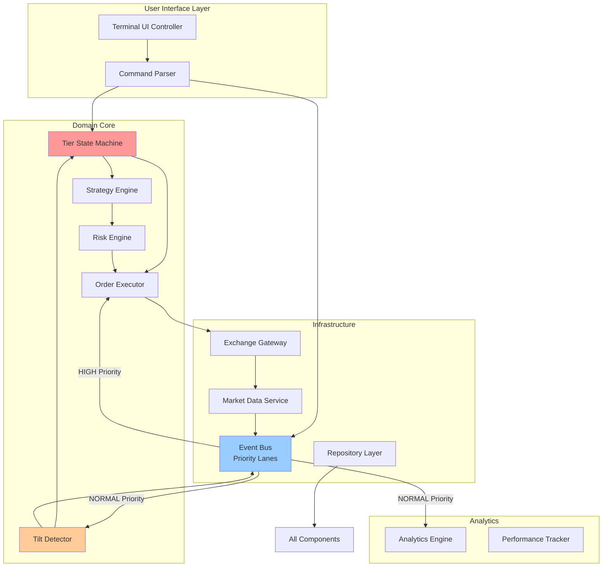

# Components

Based on our architecture, data models, and tier enforcement requirements, here are the major system components:

## Event Bus (Core Infrastructure)
**Responsibility:** Central nervous system for all component communication with priority lanes for execution events

**Key Interfaces:**
- `publish(event: Event, priority: Priority) -> None` - Emit events with HIGH (execution) or NORMAL (analytics) priority
- `subscribe(event_type: str, handler: Callable, priority: Priority) -> None` - Register handlers with priority
- `get_event_history(aggregate_id: UUID, limit: int) -> List[Event]` - Replay events for recovery

**Dependencies:** None (foundational component)

**Technology Stack:** Pure Python asyncio with priority queues, upgrades to Redis pub/sub at $2k

## Tier State Machine
**Responsibility:** Physical enforcement of tier restrictions and progression/demotion logic

**Key Interfaces:**
- `check_tier_requirement(required: Tier) -> bool` - Gate check for features
- `evaluate_progression() -> TierTransition` - Check if gates passed for upgrade
- `force_demotion(reason: str) -> None` - Emergency tier downgrade
- `get_available_features() -> List[str]` - What's unlocked at current tier

**Dependencies:** Account repository, Event Bus

**Technology Stack:** Python state machine with decorators, persistent state in SQLite

## Risk Engine
**Responsibility:** Position sizing, risk limit enforcement, and portfolio-level risk management

**Key Interfaces:**
- `calculate_position_size(balance: Decimal, risk_percent: Decimal) -> Decimal` - Safe position sizing
- `check_risk_limits(position: Position) -> RiskDecision` - Approve/reject trades
- `calculate_portfolio_risk() -> PortfolioRisk` - Overall exposure metrics
- `get_correlation_matrix() -> np.array` - Current position correlations

**Dependencies:** Position repository, Market Data Service, Event Bus

**Technology Stack:** Python with numpy for calculations, decimal for precision

## Tilt Detector
**Responsibility:** Real-time behavioral monitoring and psychological intervention

**Key Interfaces:**
- `update_metrics(action: UserAction) -> TiltScore` - Process user behavior
- `check_intervention_required() -> Intervention` - Determine if action needed
- `enforce_intervention(level: TiltLevel) -> None` - Lock trading, require journal, etc.
- `calculate_baseline() -> BehavioralBaseline` - Learn normal patterns

**Dependencies:** TiltProfile repository, Event Bus, UI Controller

**Technology Stack:** Python with scipy for statistical analysis, rolling window calculations

## Order Executor
**Responsibility:** Order placement, execution algorithms (market/iceberg/TWAP), and slicing logic

**Key Interfaces:**
- `execute_market_order(order: Order) -> ExecutionResult` - Simple market execution
- `execute_iceberg_order(order: Order, slices: int) -> ExecutionResult` - Sliced execution
- `execute_twap(order: Order, duration: int) -> ExecutionResult` - Time-weighted execution
- `cancel_all_orders() -> None` - Emergency stop

**Dependencies:** Exchange Gateway, Risk Engine, Tier State Machine

**Technology Stack:** Python asyncio, ccxt for exchange interaction

## Exchange Gateway
**Responsibility:** All Binance API interaction, connection management, and rate limiting

**Key Interfaces:**
- `place_order(order: Order) -> ExchangeOrder` - Submit to Binance
- `cancel_order(order_id: str) -> None` - Cancel existing order
- `get_balance() -> Balance` - Account balance
- `subscribe_market_data(symbol: str) -> AsyncIterator[Tick]` - Real-time prices

**Dependencies:** None (external boundary)

**Technology Stack:** ccxt, websockets, aiohttp with circuit breaker pattern

## Market Data Service
**Responsibility:** Real-time price feeds, order book management, and market state classification

**Key Interfaces:**
- `get_current_price(symbol: str) -> Decimal` - Latest price
- `get_order_book(symbol: str, depth: int) -> OrderBook` - Current depth
- `classify_market_state(symbol: str) -> MarketState` - Regime detection
- `calculate_spread(symbol: str) -> Decimal` - Current spread in bps

**Dependencies:** Exchange Gateway, Event Bus

**Technology Stack:** Python asyncio, websockets for streaming, pandas for analysis

## Strategy Engine
**Responsibility:** Strategy selection, signal generation, and trading logic orchestration

**Key Interfaces:**
- `load_strategies(tier: Tier) -> List[Strategy]` - Load tier-appropriate strategies
- `generate_signals() -> List[Signal]` - Check for trading opportunities
- `rank_opportunities(signals: List[Signal]) -> List[Signal]` - Prioritize trades
- `execute_strategy(signal: Signal) -> Position` - Act on signal

**Dependencies:** Market Data Service, Order Executor, Risk Engine

**Technology Stack:** Python with pluggable strategy modules, pandas/numpy for calculations

## Analytics Engine
**Responsibility:** Performance tracking, reporting, and forensic analysis

**Key Interfaces:**
- `calculate_performance_metrics() -> PerformanceReport` - Win rate, Sharpe, etc.
- `generate_session_report(session_id: UUID) -> SessionReport` - Trading session analysis
- `analyze_tilt_correlation() -> TiltImpact` - Behavior vs performance
- `export_for_taxes() -> CSV` - Trade history export

**Dependencies:** All repositories, Event Bus (subscriber only)

**Technology Stack:** Python with pandas for analysis, structlog for forensics

## Terminal UI Controller
**Responsibility:** Render "Digital Zen Garden" interface, handle commands, display real-time data

**Key Interfaces:**
- `render_dashboard() -> None` - Update terminal display
- `process_command(cmd: str) -> CommandResult` - Parse and execute user input
- `show_intervention(message: str, level: TiltLevel) -> None` - Display tilt warnings
- `update_tier_progress() -> None` - Show gate completion status

**Dependencies:** All other components (UI is the integration point)

**Technology Stack:** Rich for rendering, Textual for interaction, asyncio for real-time updates

## Data Repository Layer
**Responsibility:** Abstract database operations for migration path

**Key Interfaces:**
- `save(entity: Entity) -> None` - Persist any domain object
- `find_by_id(entity_type: Type, id: UUID) -> Entity` - Retrieve by ID
- `query(criteria: QueryCriteria) -> List[Entity]` - Complex queries
- `migrate_to_postgres() -> None` - One-command migration at $2k

**Dependencies:** Database connections (SQLite/PostgreSQL)

**Technology Stack:** Python with SQLAlchemy core (not ORM), Alembic for migrations

## Component Interaction Diagram

