# Core Workflows

These sequence diagrams illustrate the critical system workflows, showing how components interact without tight coupling through the Event Bus.

## Order Execution Flow (Sniper Tier - Simple Market Order)

```mermaid
sequenceDiagram
    participant User
    participant TUI as Terminal UI
    participant CMD as Command Parser
    participant TSM as Tier State Machine
    participant RE as Risk Engine
    participant TD as Tilt Detector
    participant OE as Order Executor
    participant EG as Exchange Gateway
    participant EB as Event Bus
    participant DB as Database

    User->>TUI: "buy 100 usdt btc"
    TUI->>CMD: Parse command
    CMD->>TSM: Check tier permissions
    TSM-->>CMD: SNIPER tier, market orders allowed
    
    CMD->>RE: Calculate position size
    RE->>DB: Get account balance
    DB-->>RE: $500 balance
    RE-->>CMD: Position size: $25 (5% rule)
    
    CMD->>TD: Check tilt status
    TD-->>CMD: Tilt score: 15 (NORMAL)
    
    CMD->>OE: Execute market order
    OE->>EG: Place order on Binance
    
    Note over EG: Circuit breaker checks
    EG->>Binance: POST /api/v3/order
    Binance-->>EG: Order filled @ $67,453
    
    EG-->>OE: Execution result
    OE->>EB: Publish OrderExecuted event (HIGH priority)
    OE->>DB: Save order and position
    
    EB-->>TD: Update behavioral metrics
    EB-->>Analytics: Record for analysis (NORMAL priority)
    
    OE-->>TUI: Display confirmation
    TUI-->>User: "✓ Bought 0.00037 BTC @ $67,453"
```

## Tilt Detection and Intervention Flow

```mermaid
sequenceDiagram
    participant User
    participant TUI as Terminal UI
    participant TD as Tilt Detector
    participant TSM as Tier State Machine
    participant EB as Event Bus
    participant DB as Database

    loop Every user action
        User->>TUI: Rapid clicking/typing
        TUI->>EB: Publish UserAction event
        EB->>TD: Process behavioral data
        TD->>TD: Calculate deviation from baseline
    end

    Note over TD: Multiple indicators triggered
    TD->>DB: Get TiltProfile
    DB-->>TD: Baseline metrics
    
    TD->>TD: Tilt score: 65 (WARNING)
    TD->>EB: Publish TiltDetected event
    
    EB->>TSM: Tilt intervention required
    TSM->>TSM: Lock trading features
    TSM->>TUI: Display intervention
    
    TUI-->>User: "🟧 Trading paused - Performance optimization needed"
    TUI-->>User: "Write 500 words about your emotional state to continue"
    
    User->>TUI: Journal entry
    TUI->>TD: Process recovery
    TD->>DB: Save journal entry
    TD->>TSM: Clear intervention
    TSM->>TSM: Unlock with 50% position limits
    TSM->>TUI: Update status
    TUI-->>User: "Trading resumed - Position sizes limited for 1 hour"
```

## Tier Transition Flow ($2k Sniper → Hunter)

```mermaid
sequenceDiagram
    participant System
    participant TSM as Tier State Machine
    participant DB as Database
    participant RE as Risk Engine
    participant EB as Event Bus
    participant TUI as Terminal UI
    participant User

    System->>TSM: Daily tier evaluation
    TSM->>DB: Check gate requirements
    DB-->>TSM: Account balance: $2,150
    DB-->>TSM: 30 days at tier: ✓
    DB-->>TSM: 60% profitable days: ✓
    DB-->>TSM: No position violations: ✓
    DB-->>TSM: 90% execution speed: ✓
    
    TSM->>TSM: All gates passed
    TSM->>EB: Publish TierTransition event
    
    EB->>DB: Update account tier
    EB->>RE: Update risk parameters
    EB->>TUI: Trigger ceremony
    
    TUI-->>User: "🎯 TIER ADVANCEMENT READY"
    TUI-->>User: "You've earned Hunter tier capabilities"
    TUI-->>User: "New features: Order slicing, Multi-pair trading"
    TUI-->>User: "Type 'I understand the responsibilities' to proceed"
    
    User->>TUI: Confirmation
    
    TSM->>TSM: Activate Hunter features
    TSM->>DB: Log tier transition
    
    Note over TSM: 48-hour adjustment period begins
    TSM->>RE: Set conservative limits for 48h
```

## Iceberg Order Execution (Hunter Tier)

```mermaid
sequenceDiagram
    participant CMD as Command Parser
    participant TSM as Tier State Machine
    participant OE as Order Executor
    participant EG as Exchange Gateway
    participant MDS as Market Data Service
    participant EB as Event Bus

    CMD->>TSM: Request iceberg execution
    TSM-->>CMD: HUNTER tier, slicing allowed
    
    CMD->>OE: Execute iceberg ($300 total)
    OE->>MDS: Get order book depth
    MDS-->>OE: Liquidity analysis
    
    OE->>OE: Calculate slices (3x $100)
    
    loop For each slice
        Note over OE: Random delay 1-5 seconds
        OE->>OE: Wait random interval
        OE->>OE: Vary size ±20% ($80-120)
        
        OE->>EG: Place limit order
        EG->>Binance: POST /api/v3/order
        Binance-->>EG: Slice filled
        EG-->>OE: Confirmation
        
        OE->>EB: Publish SliceExecuted event
        
        OE->>MDS: Check market impact
        MDS-->>OE: Price moved 0.2%
        
        alt Price impact > 0.5%
            OE->>OE: Abort remaining slices
            OE->>EB: Publish IcebergAborted event
        end
    end
    
    OE->>EB: Publish IcebergComplete event
    OE-->>CMD: Execution complete
```

## Emergency Demotion Flow

