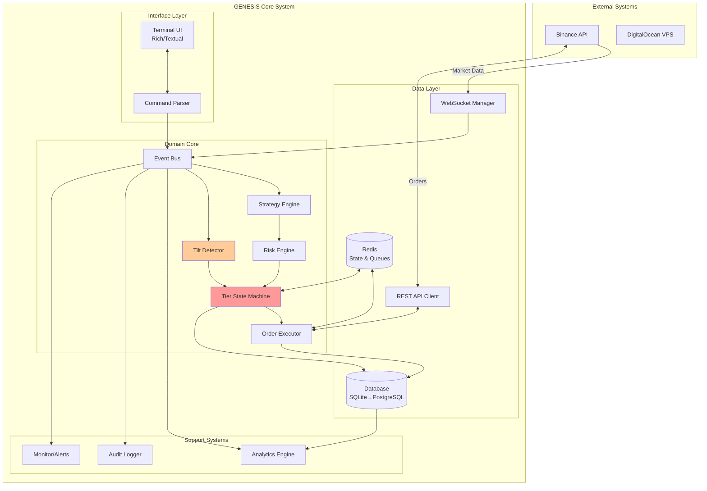

# High Level Architecture

## Technical Summary

Project GENESIS is an event-driven, monolithic-to-microservices cryptocurrency trading system that evolves with capital growth. Built on Python's asyncio framework, it implements a tier-locked state machine that physically prevents destructive behaviors by enforcing execution strategies appropriate to account size. The architecture uses domain-driven design with clear module boundaries, enabling the planned migration from SQLite to PostgreSQL to Rust components without major rewrites. Core patterns include event sourcing for audit trails, repository pattern for data abstraction, and command pattern for order execution, all orchestrated through a central event bus that enables real-time psychological monitoring and intervention.

## High Level Overview

1. **Architectural Style**: **Evolutionary Monolith** - Starting as a well-structured monolith with clear domain boundaries, designed to decompose into services as capital grows. This isn't a traditional monolith but a "modular monolith" with service-oriented internal architecture.

2. **Repository Structure**: **Monorepo** - All components in a single repository with clear modular separation (/engine, /strategies, /risk, /tilt, /analytics, /infrastructure). This supports atomic tier transitions and prevents version mismatches during critical evolution points.

3. **Service Architecture**: 
   - **Phase 1 ($500-$2k)**: Single Python process with asyncio
   - **Phase 2 ($2k-$10k)**: Modular monolith with hot-swappable strategies
   - **Phase 3 ($10k+)**: Service-oriented with Rust execution engine

4. **Primary Data Flow**: Market Data → Event Bus → Strategy Engine → Risk Validation → Tilt Check → Order Execution → Position Management → Analytics Pipeline

5. **Key Architectural Decisions**:
   - Event-driven architecture for loose coupling and real-time monitoring
   - Repository pattern to abstract database transitions (SQLite → PostgreSQL)
   - State machine pattern for tier management (prevents manual override)
   - Command/Query separation for order execution vs analytics
   - Circuit breaker pattern for API resilience

## High Level Project Diagram

## Architectural and Design Patterns

- **Event-Driven Architecture:** Using asyncio event loops with publish-subscribe pattern via internal event bus - *Rationale:* Enables real-time tilt detection, loose coupling between components, and audit trail generation without impacting execution latency

- **Repository Pattern:** Abstract data access layer wrapping SQLite/PostgreSQL/Redis operations - *Rationale:* Allows seamless database migration at tier transitions without changing business logic, critical for $2k SQLite→PostgreSQL evolution

- **State Machine Pattern:** Tier-locked finite state machine controlling feature availability - *Rationale:* Physically prevents access to dangerous features before psychological readiness, enforcing discipline through code

- **Command Pattern:** Encapsulated order objects with validation, execution, and rollback - *Rationale:* Enables order queuing, slicing algorithms, and comprehensive audit trail for every trading decision

- **Circuit Breaker Pattern:** API call wrapper with failure detection and automatic recovery - *Rationale:* Prevents cascade failures during Binance outages, essential for 99.5% uptime requirement

- **Domain-Driven Design:** Bounded contexts for Risk, Trading, Psychology, Analytics domains - *Rationale:* Clear module boundaries enable component replacement during Rust migration without system-wide refactoring

- **Event Sourcing:** All state changes recorded as events for reconstruction - *Rationale:* Provides complete audit trail for forensic analysis, tilt pattern detection, and recovery from crashes

- **CQRS Lite:** Separate paths for order execution (commands) vs analytics (queries) - *Rationale:* Optimizes <100ms execution path while enabling complex analytics without performance impact
