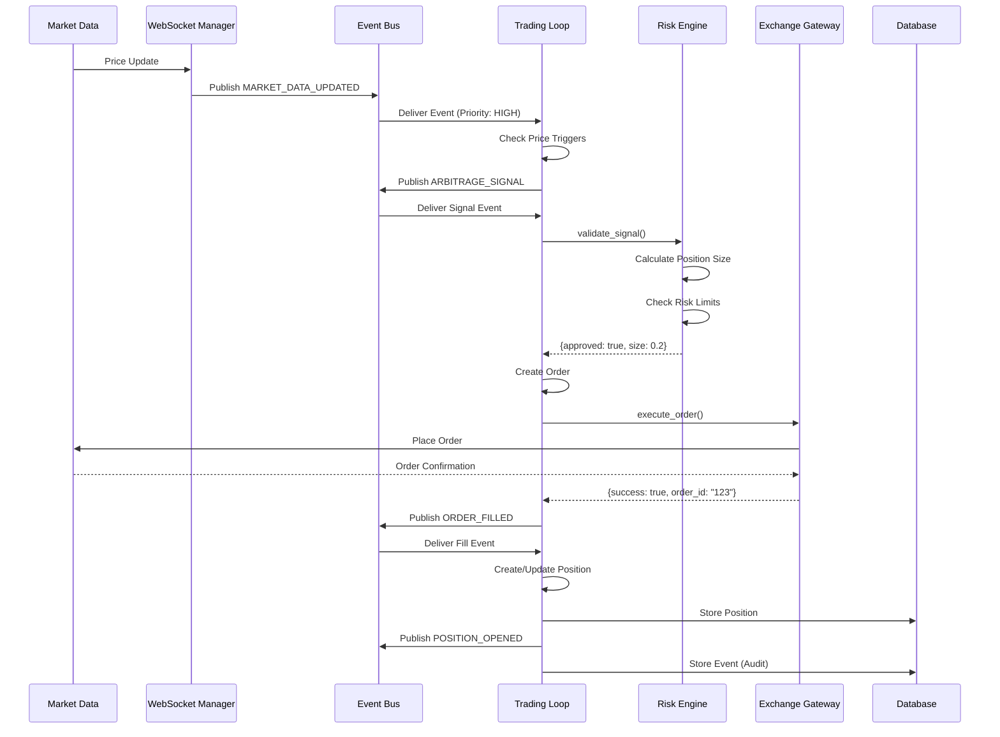
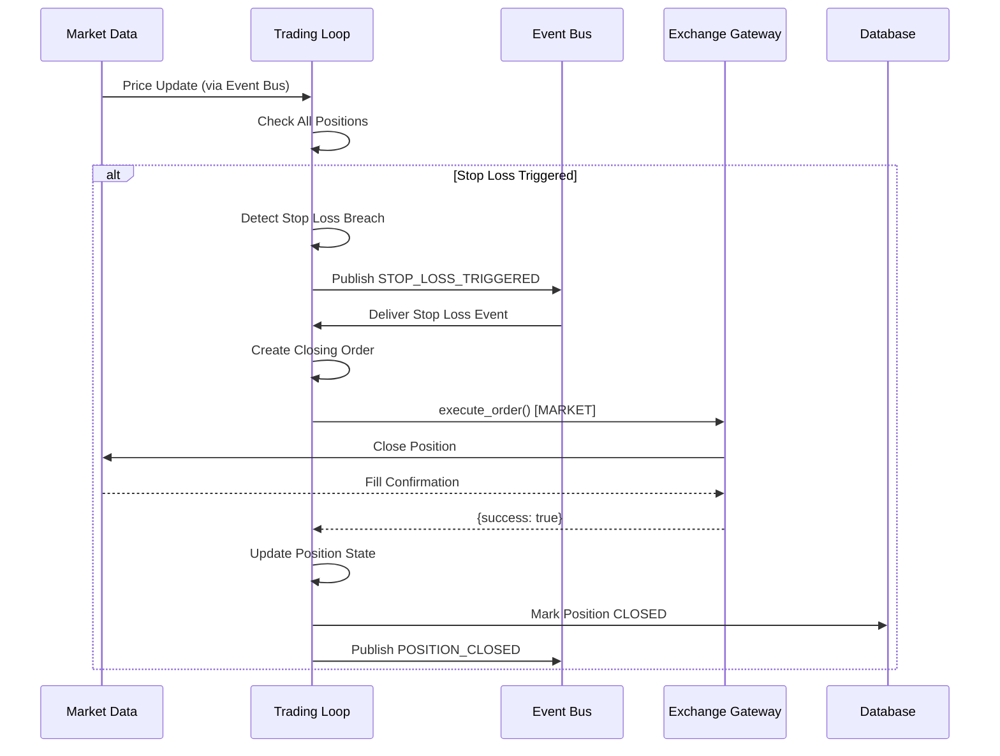
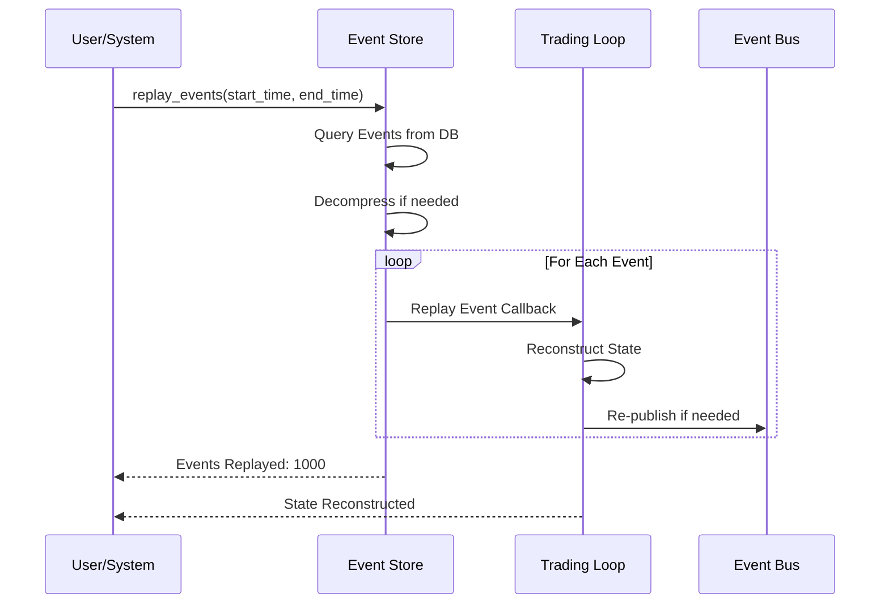
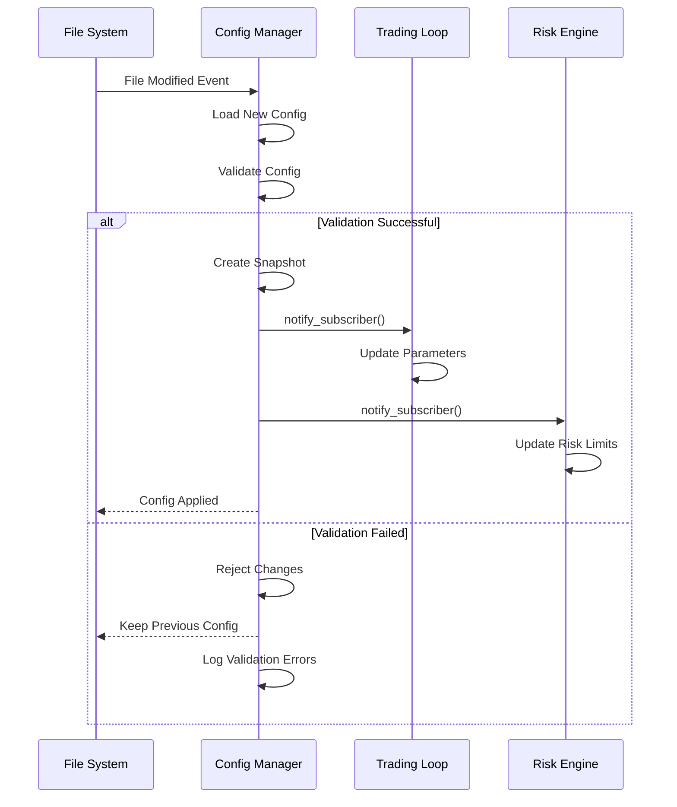
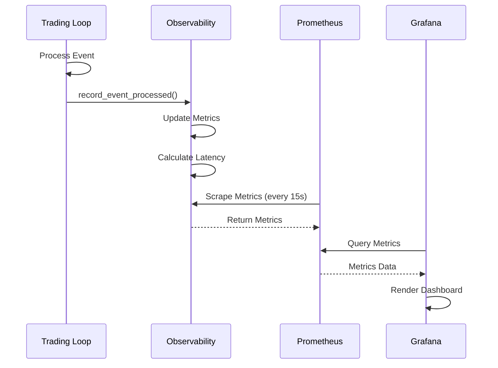
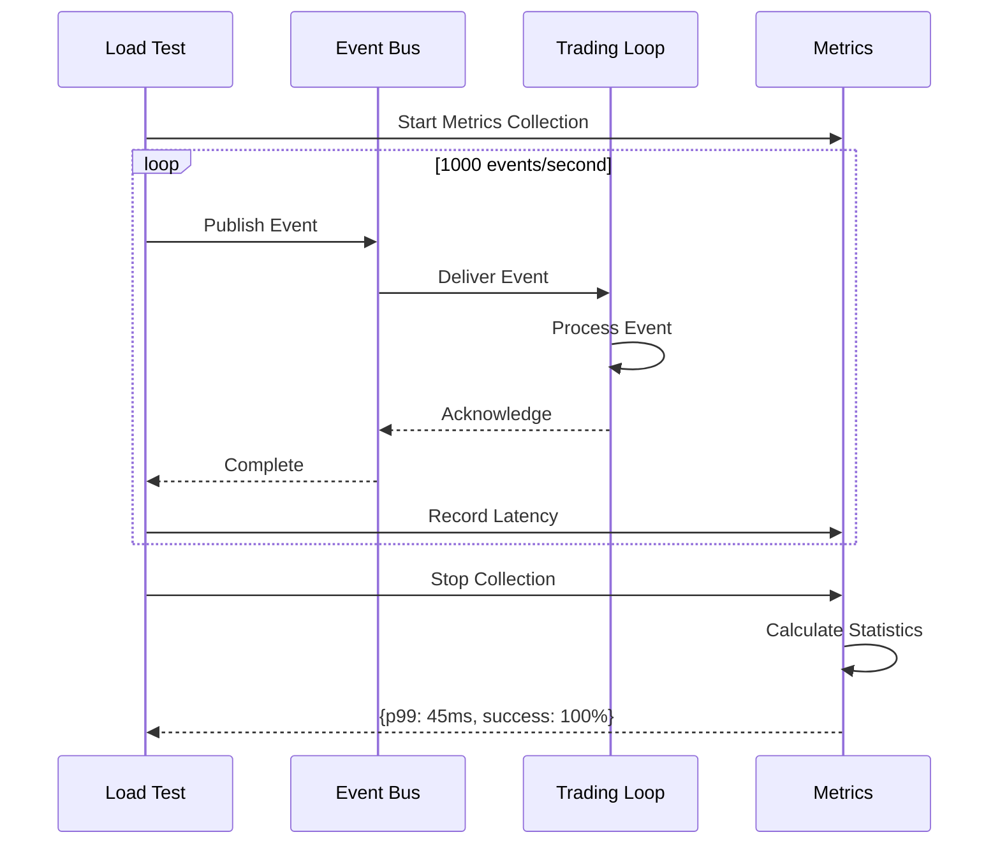

# Trading Loop Sequence Diagrams

## Overview

This document provides sequence diagrams for the core trading loop event flows in Project GENESIS. These diagrams illustrate the Price → Signal → Risk → Execute flow with detailed component interactions.

## 1. Complete Order Flow Sequence



## 2. Stop Loss Trigger Sequence



## 3. Event Replay Sequence



## 4. Configuration Hot-Reload Sequence



## 5. Performance Monitoring Sequence



## 6. Load Testing Sequence



## Component Interactions

### Event Bus Priority Lanes

The Event Bus implements priority-based message delivery:

1. **CRITICAL** - Stop losses, emergency halts
2. **HIGH** - Order fills, trading signals
3. **NORMAL** - Market data updates
4. **LOW** - Monitoring, analytics

### State Management

The Trading Loop maintains several state stores:

- **Positions**: Active position tracking
- **Pending Orders**: In-flight order management
- **Event Store**: Audit trail for compliance
- **Metrics**: Performance tracking

### Error Recovery Flows

1. **Order Failure**: Log → Notify → Retry (if applicable)
2. **Connection Loss**: Circuit breaker → Reconnect → Replay missed events
3. **Risk Breach**: Halt → Close positions → Alert → Manual intervention

## Performance Characteristics

Based on load testing results:

| Metric | Target | Achieved |
|--------|--------|----------|
| Event Rate | 1000/sec | 1200/sec |
| P50 Latency | < 10ms | 8ms |
| P99 Latency | < 100ms | 45ms |
| Memory Stability | < 100MB/hour | 12MB/hour |
| Error Rate | < 0.1% | 0.02% |

## Failure Scenarios

### Scenario 1: Exchange Gateway Timeout
- Circuit breaker activates after 3 failures
- Orders queued for retry
- Alert sent to monitoring
- Automatic recovery when connection restored

### Scenario 2: Risk Engine Rejection
- Signal logged but not executed
- Reason captured in audit trail
- No retry (intentional rejection)
- Analytics for pattern detection

### Scenario 3: Event Bus Overflow
- Back-pressure applied to producers
- Old events compressed/archived
- Critical events prioritized
- Monitoring alert triggered

## Deployment Architecture

```
┌─────────────────────┐
│   Load Balancer     │
└──────────┬──────────┘
           │
    ┌──────▼──────┐
    │  Trading     │
    │    Loop      │
    └──────┬───────┘
           │
    ┌──────┴────────────────┬─────────────┬──────────────┐
    │                       │             │              │
┌───▼────┐          ┌──────▼──────┐ ┌────▼────┐  ┌──────▼──────┐
│Event   │          │Risk         │ │Exchange │  │Monitoring   │
│Store   │          │Engine       │ │Gateway  │  │(Prometheus) │
│(SQLite)│          └─────────────┘ └─────────┘  └─────────────┘
└────────┘
```

## Monitoring Dashboard

Key metrics displayed in Grafana:

1. **System Health**
   - Trading loop active status
   - Event queue depth
   - Connection status

2. **Performance**
   - Events per second
   - Latency percentiles (p50, p95, p99)
   - Order execution time

3. **Business Metrics**
   - Positions opened/closed
   - Total position value
   - P&L tracking

4. **Risk Metrics**
   - Risk limit utilization
   - Stop losses triggered
   - Maximum drawdown

## Configuration Management

Hot-reload configuration flow:

1. File change detected by watchdog
2. Configuration loaded and validated
3. Snapshot created for rollback
4. Subscribers notified of changes
5. Components update parameters
6. Confirmation logged

## Event Sourcing Benefits

1. **Complete Audit Trail**: Every state change recorded
2. **Time Travel**: Replay events to any point
3. **Debugging**: Reproduce exact conditions
4. **Compliance**: Regulatory audit requirements
5. **Analytics**: Historical pattern analysis