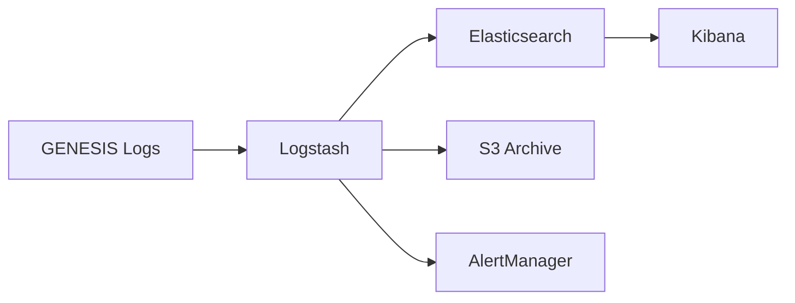

# ELK Stack Setup Guide

## Overview

The ELK (Elasticsearch, Logstash, Kibana) stack provides centralized log aggregation, search, and visualization for Project GENESIS.

## Architecture



## Components

### Elasticsearch

**Purpose**: Log storage and indexing
**Version**: 8.11.0
**Configuration**:
- Index pattern: `genesis-{type}-{date}`
- Retention: 7 days hot, 30 days warm, 90 days cold
- Shards: 3 primary, 1 replica

### Logstash

**Purpose**: Log ingestion and processing
**Version**: 8.11.0
**Pipelines**:
- Trading logs pipeline
- Audit logs pipeline
- Tilt monitoring pipeline
- Performance metrics pipeline

### Kibana

**Purpose**: Log visualization and search
**Version**: 8.11.0
**Features**:
- Saved searches
- Custom dashboards
- Alert rules
- ML anomaly detection

## Installation

### Docker Deployment

```bash
# Start ELK stack
docker-compose -f docker/docker-compose.elk.yml up -d

# Verify services
curl -X GET "localhost:9200/_cluster/health?pretty"
curl -X GET "localhost:5601/api/status"
```

### Docker Compose Configuration

```yaml
version: '3.8'

services:
  elasticsearch:
    image: docker.elastic.co/elasticsearch/elasticsearch:8.11.0
    container_name: genesis-elasticsearch
    environment:
      - discovery.type=single-node
      - xpack.security.enabled=true
      - xpack.security.authc.api_key.enabled=true
      - ELASTIC_PASSWORD=${ELASTIC_PASSWORD}
      - ES_JAVA_OPTS=-Xms2g -Xmx2g
    volumes:
      - elasticsearch-data:/usr/share/elasticsearch/data
    ports:
      - "9200:9200"
    networks:
      - genesis-network

  logstash:
    image: docker.elastic.co/logstash/logstash:8.11.0
    container_name: genesis-logstash
    volumes:
      - ./docker/elk/logstash.conf:/usr/share/logstash/pipeline/logstash.conf
      - ./docker/elk/templates:/etc/logstash/templates
      - ../.genesis/logs:/genesis/logs:ro
    environment:
      - ELASTICSEARCH_HOST=elasticsearch:9200
      - ELASTICSEARCH_USERNAME=elastic
      - ELASTICSEARCH_PASSWORD=${ELASTIC_PASSWORD}
    ports:
      - "5000:5000/tcp"
      - "5001:5001/udp"
    depends_on:
      - elasticsearch
    networks:
      - genesis-network

  kibana:
    image: docker.elastic.co/kibana/kibana:8.11.0
    container_name: genesis-kibana
    environment:
      - ELASTICSEARCH_HOSTS=http://elasticsearch:9200
      - ELASTICSEARCH_USERNAME=elastic
      - ELASTICSEARCH_PASSWORD=${ELASTIC_PASSWORD}
    ports:
      - "5601:5601"
    depends_on:
      - elasticsearch
    networks:
      - genesis-network

volumes:
  elasticsearch-data:

networks:
  genesis-network:
    driver: bridge
```

## Log Format

### Required Fields

All GENESIS logs must include:
```json
{
  "timestamp": "2024-01-15T10:30:45.123Z",
  "level": "INFO",
  "component": "engine.executor",
  "message": "Order executed successfully",
  "correlation_id": "550e8400-e29b-41d4-a716-446655440000"
}
```

### Trading Log Schema

```json
{
  "timestamp": "2024-01-15T10:30:45.123Z",
  "level": "INFO",
  "component": "engine.executor",
  "event_type": "ORDER_FILLED",
  "correlation_id": "550e8400-e29b-41d4-a716-446655440000",
  "data": {
    "order_id": "ORD-123456",
    "symbol": "BTC/USDT",
    "side": "buy",
    "price": 45000.00,
    "quantity": 0.1,
    "execution_time_ms": 45.2
  }
}
```

### Audit Log Schema

```json
{
  "timestamp": "2024-01-15T10:30:45.123Z",
  "level": "WARNING",
  "component": "security.auth",
  "event_type": "PERMISSION_DENIED",
  "user_id": "user-123",
  "action": "MODIFY_TIER",
  "resource": "tier_configuration",
  "reason": "Insufficient privileges"
}
```

### Tilt Log Schema

```json
{
  "timestamp": "2024-01-15T10:30:45.123Z",
  "level": "WARNING",
  "component": "tilt.detector",
  "tilt_score": 75.5,
  "indicators": {
    "click_speed": 0.85,
    "cancel_rate": 0.72,
    "revenge_trading": 0.68
  },
  "intervention": "REDUCE_POSITION_SIZE"
}
```

## Index Management

### Index Lifecycle Policy

```json
{
  "policy": {
    "phases": {
      "hot": {
        "actions": {
          "rollover": {
            "max_age": "7d",
            "max_size": "50GB"
          }
        }
      },
      "warm": {
        "min_age": "7d",
        "actions": {
          "shrink": {
            "number_of_shards": 1
          },
          "forcemerge": {
            "max_num_segments": 1
          }
        }
      },
      "cold": {
        "min_age": "30d",
        "actions": {
          "searchable_snapshot": {
            "snapshot_repository": "s3_repository"
          }
        }
      },
      "delete": {
        "min_age": "90d",
        "actions": {
          "delete": {}
        }
      }
    }
  }
}
```

### Index Templates

```bash
# Create index template
curl -X PUT "localhost:9200/_index_template/genesis-logs" \
  -H "Content-Type: application/json" \
  -d '{
    "index_patterns": ["genesis-*"],
    "template": {
      "settings": {
        "number_of_shards": 3,
        "number_of_replicas": 1,
        "index.lifecycle.name": "genesis-ilm-policy"
      },
      "mappings": {
        "properties": {
          "timestamp": { "type": "date" },
          "level": { "type": "keyword" },
          "component": { "type": "keyword" },
          "message": { "type": "text" },
          "correlation_id": { "type": "keyword" },
          "tilt_score": { "type": "float" },
          "execution_time_ms": { "type": "float" }
        }
      }
    }
  }'
```

## Kibana Configuration

### Saved Searches

1. **Failed Orders**
```
event_type:"ORDER_FAILED" OR event_type:"ORDER_REJECTED"
```

2. **High Tilt Events**
```
tilt_score:>70
```

3. **Security Alerts**
```
tags:"security_alert"
```

4. **Slow Executions**
```
execution_time_ms:>100
```

5. **Connection Issues**
```
event_type:"CONNECTION_LOST" OR event_type:"WEBSOCKET_ERROR"
```

### Dashboards

1. **Trading Activity Dashboard**
   - Order flow visualization
   - Success/failure rates
   - Execution time distribution
   - Volume by symbol

2. **Security Dashboard**
   - Authentication attempts
   - Permission denials
   - Configuration changes
   - API access patterns

3. **Tilt Monitoring Dashboard**
   - Tilt score timeline
   - Behavioral indicator heatmap
   - Intervention frequency
   - Correlation with P&L

### Alert Rules

```json
{
  "trigger": {
    "schedule": {
      "interval": "1m"
    }
  },
  "input": {
    "search": {
      "request": {
        "indices": ["genesis-*"],
        "body": {
          "query": {
            "bool": {
              "must": [
                { "range": { "tilt_score": { "gte": 90 } } },
                { "range": { "@timestamp": { "gte": "now-5m" } } }
              ]
            }
          }
        }
      }
    }
  },
  "actions": {
    "send_alert": {
      "webhook": {
        "method": "POST",
        "url": "http://alertmanager:9093/api/v1/alerts",
        "body": "{\"alert\": \"Critical tilt detected\"}"
      }
    }
  }
}
```

## Log Shipping

### From Application

```python
import structlog
from pythonjsonlogger import jsonlogger

# Configure structured logging
structlog.configure(
    processors=[
        structlog.stdlib.filter_by_level,
        structlog.stdlib.add_logger_name,
        structlog.stdlib.add_log_level,
        structlog.stdlib.PositionalArgumentsFormatter(),
        structlog.processors.TimeStamper(fmt="iso"),
        structlog.processors.StackInfoRenderer(),
        structlog.processors.format_exc_info,
        structlog.processors.UnicodeDecoder(),
        structlog.processors.JSONRenderer()
    ],
    context_class=dict,
    logger_factory=structlog.stdlib.LoggerFactory(),
    cache_logger_on_first_use=True,
)

# Log to file for Logstash pickup
logger = structlog.get_logger()
logger.info(
    "Order executed",
    event_type="ORDER_FILLED",
    order_id="ORD-123",
    execution_time_ms=45.2
)
```

### Remote Logging

```python
import socket
import json

class LogstashHandler:
    def __init__(self, host="localhost", port=5000):
        self.host = host
        self.port = port
        self.sock = socket.socket(socket.AF_INET, socket.SOCK_STREAM)
        self.sock.connect((host, port))
    
    def send(self, log_entry):
        message = json.dumps(log_entry) + "\n"
        self.sock.send(message.encode())
```

## Search Queries

### Elasticsearch DSL

```python
from elasticsearch import Elasticsearch

es = Elasticsearch(
    ["localhost:9200"],
    basic_auth=("elastic", "password")
)

# Search for failed orders in last hour
response = es.search(
    index="genesis-trading-*",
    body={
        "query": {
            "bool": {
                "must": [
                    {"match": {"event_type": "ORDER_FAILED"}},
                    {"range": {"@timestamp": {"gte": "now-1h"}}}
                ]
            }
        },
        "aggs": {
            "failure_reasons": {
                "terms": {"field": "failure_reason.keyword"}
            }
        }
    }
)
```

### Kibana Query Language (KQL)

```
# Find high-value trades
data.price > 50000 and data.quantity > 1

# Correlation search
correlation_id:"550e8400-e29b-41d4-a716-446655440000"

# Time-based search
@timestamp >= "2024-01-15T00:00:00" and @timestamp < "2024-01-16T00:00:00"

# Pattern matching
component:engine.* and level:ERROR
```

## Performance Tuning

### Elasticsearch Optimization

```yaml
# elasticsearch.yml
thread_pool:
  write:
    size: 10
    queue_size: 1000

indices:
  memory:
    index_buffer_size: 30%
  queries:
    cache:
      size: 20%

# JVM Options
-Xms4g
-Xmx4g
-XX:+UseG1GC
-XX:MaxGCPauseMillis=200
```

### Logstash Optimization

```yaml
# logstash.yml
pipeline:
  workers: 4
  batch:
    size: 500
    delay: 50

queue:
  type: persisted
  max_bytes: 4gb
  checkpoint:
    writes: 1024
```

## Monitoring ELK Stack

### Metricbeat Configuration

```yaml
metricbeat.modules:
- module: elasticsearch
  metricsets:
    - node
    - node_stats
    - index
  period: 10s
  hosts: ["localhost:9200"]

- module: logstash
  metricsets:
    - node
    - node_stats
  period: 10s
  hosts: ["localhost:9600"]

- module: kibana
  metricsets:
    - stats
    - status
  period: 10s
  hosts: ["localhost:5601"]
```

## Security

### Authentication

```bash
# Create API key for Logstash
curl -X POST "localhost:9200/_security/api_key" \
  -H "Content-Type: application/json" \
  -u elastic:password \
  -d '{
    "name": "logstash-api-key",
    "role_descriptors": {
      "logstash_writer": {
        "cluster": ["manage_index_templates", "monitor"],
        "indices": [
          {
            "names": ["genesis-*"],
            "privileges": ["write", "create_index"]
          }
        ]
      }
    }
  }'
```

### TLS Configuration

```yaml
# elasticsearch.yml
xpack.security.transport.ssl:
  enabled: true
  verification_mode: certificate
  keystore.path: certs/elastic-certificates.p12
  truststore.path: certs/elastic-certificates.p12

xpack.security.http.ssl:
  enabled: true
  keystore.path: certs/http.p12
```

## Backup and Recovery

### Snapshot Repository

```bash
# Configure S3 repository
curl -X PUT "localhost:9200/_snapshot/s3_backup" \
  -H "Content-Type: application/json" \
  -d '{
    "type": "s3",
    "settings": {
      "bucket": "genesis-elasticsearch-backups",
      "region": "us-east-1",
      "compress": true,
      "server_side_encryption": true
    }
  }'

# Create snapshot
curl -X PUT "localhost:9200/_snapshot/s3_backup/snapshot_1?wait_for_completion=true"

# Restore snapshot
curl -X POST "localhost:9200/_snapshot/s3_backup/snapshot_1/_restore"
```

## Troubleshooting

### Common Issues

1. **High Memory Usage**
   - Adjust JVM heap size
   - Reduce index shard count
   - Enable index compression

2. **Slow Queries**
   - Add more specific index patterns
   - Use filters instead of queries
   - Enable query caching

3. **Log Ingestion Delays**
   - Increase Logstash workers
   - Use persistent queues
   - Optimize grok patterns

### Debug Commands

```bash
# Check cluster health
curl -X GET "localhost:9200/_cluster/health?pretty"

# View index stats
curl -X GET "localhost:9200/genesis-*/_stats?pretty"

# Check Logstash pipeline
curl -X GET "localhost:9600/_node/stats/pipelines?pretty"

# Kibana status
curl -X GET "localhost:5601/api/status"
```

## Next Steps

1. Configure distributed tracing integration
2. Set up machine learning jobs for anomaly detection
3. Create custom Kibana plugins
4. Implement log-based alerting rules