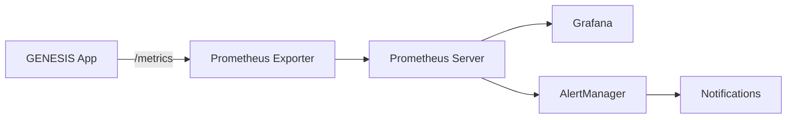

# Prometheus Setup Guide

## Overview

Prometheus is the core metrics collection system for Project GENESIS, providing real-time monitoring of trading performance, system health, and behavioral indicators.

## Architecture



## Installation

### Docker Deployment

```bash
# Start Prometheus with docker-compose
docker-compose -f docker/docker-compose.monitoring.yml up -d prometheus

# Verify Prometheus is running
curl http://localhost:9090/-/healthy
```

### Manual Installation

```bash
# Download Prometheus 2.48.1
wget https://github.com/prometheus/prometheus/releases/download/v2.48.1/prometheus-2.48.1.linux-amd64.tar.gz
tar xvf prometheus-2.48.1.linux-amd64.tar.gz
cd prometheus-2.48.1.linux-amd64

# Start with custom config
./prometheus --config.file=/path/to/genesis/docker/prometheus/prometheus.yml
```

## Configuration

### Environment Variables

```bash
# Set in .env file
PROMETHEUS_AUTH_TOKEN=your-secure-token-here
PROMETHEUS_PORT=9090
PROMETHEUS_RETENTION_TIME=15d
PROMETHEUS_RETENTION_SIZE=10GB
```

### Scrape Configuration

The Prometheus configuration (`docker/prometheus/prometheus.yml`) defines:

- **Scrape Interval**: 10s for GENESIS metrics
- **Evaluation Interval**: 15s for alert rules
- **Retention**: 15 days high-resolution, 90 days downsampled
- **Authentication**: Bearer token for secure metrics endpoint

## Metrics Exported

### Trading Metrics

| Metric | Type | Description |
|--------|------|-------------|
| `genesis_orders_total` | Counter | Total orders placed |
| `genesis_orders_failed_total` | Counter | Total failed orders |
| `genesis_trades_total` | Counter | Total trades executed |
| `genesis_position_count` | Gauge | Current open positions |
| `genesis_pnl_dollars` | Gauge | Current P&L in dollars |
| `genesis_drawdown_percent` | Gauge | Current drawdown percentage |

### Performance Metrics

| Metric | Type | Description |
|--------|------|-------------|
| `genesis_order_execution_time_seconds` | Histogram | Order execution latency |
| `genesis_websocket_latency_ms` | Histogram | WebSocket message latency |
| `genesis_rate_limit_usage_ratio` | Gauge | Rate limit usage (0-1) |

### System Metrics

| Metric | Type | Description |
|--------|------|-------------|
| `genesis_up` | Gauge | Process uptime in seconds |
| `genesis_connection_status` | Gauge | Connection status (1=connected) |
| `genesis_memory_usage_bytes` | Gauge | Memory usage |
| `genesis_cpu_usage_percent` | Gauge | CPU usage percentage |

### Behavioral Metrics

| Metric | Type | Description |
|--------|------|-------------|
| `genesis_tilt_score` | Gauge | Current tilt score (0-100) |

## Integration with GENESIS

### Starting the Exporter

```python
from genesis.monitoring import PrometheusExporter, MetricsRegistry

# Initialize registry and exporter
registry = MetricsRegistry()
exporter = PrometheusExporter(
    registry=registry,
    port=9090,
    auth_token=os.getenv("PROMETHEUS_AUTH_TOKEN")
)

# Start exporter in background
await exporter.start()
```

### Recording Metrics

```python
from genesis.monitoring import MetricsCollector

# Initialize collector
collector = MetricsCollector(registry)
await collector.start()

# Record order execution
await collector.record_order(order)
await collector.record_execution_time(0.045)

# Update P&L
await collector.update_pnl(
    realized=Decimal("1000.00"),
    unrealized=Decimal("250.50")
)

# Update connection status
await collector.update_connection_status(True, "binance")
```

## Querying Metrics

### Basic Queries

```promql
# Current P&L
genesis_pnl_dollars

# Order execution rate (per second)
rate(genesis_orders_total[5m])

# Failed order percentage
rate(genesis_orders_failed_total[5m]) / rate(genesis_orders_total[5m]) * 100

# Average execution time (last 5 minutes)
rate(genesis_order_execution_time_seconds_sum[5m]) / rate(genesis_order_execution_time_seconds_count[5m])

# P99 WebSocket latency
histogram_quantile(0.99, rate(genesis_websocket_latency_ms_bucket[5m]))
```

### Advanced Queries

```promql
# Drawdown alert condition
genesis_drawdown_percent > 5 and increase(genesis_drawdown_percent[1h]) > 3

# Tilt correlation with losses
genesis_tilt_score > 70 and delta(genesis_pnl_dollars[10m]) < 0

# Rate limit approaching threshold
genesis_rate_limit_usage_ratio > 0.8

# Connection stability
avg_over_time(genesis_connection_status[5m]) < 0.95
```

## Security Considerations

1. **Authentication**: Always use bearer token authentication for metrics endpoint
2. **Network**: Restrict Prometheus server access to trusted networks
3. **TLS**: Use TLS for production deployments
4. **Secrets**: Never expose sensitive data in metric labels

## Retention and Storage

### Retention Policy

- **High Resolution**: 15 days (10s intervals)
- **Downsampled**: 90 days (5m intervals)
- **Storage Limit**: 10GB maximum

### Remote Storage

For long-term storage, configure remote write to:
- InfluxDB for time-series optimization
- S3 for cold storage archival
- Thanos for unlimited retention

## Troubleshooting

### Common Issues

1. **High Memory Usage**
   - Reduce retention time
   - Increase scrape interval
   - Use recording rules for expensive queries

2. **Missing Metrics**
   - Check bearer token configuration
   - Verify network connectivity
   - Review Prometheus logs

3. **Slow Queries**
   - Add recording rules for frequently used queries
   - Optimize label cardinality
   - Use rate() instead of increase() for counters

### Debug Commands

```bash
# Check Prometheus targets
curl http://localhost:9090/api/v1/targets

# Query specific metric
curl http://localhost:9090/api/v1/query?query=genesis_pnl_dollars

# Check configuration
curl http://localhost:9090/api/v1/status/config

# View runtime information
curl http://localhost:9090/api/v1/status/runtimeinfo
```

## Best Practices

1. **Label Cardinality**: Keep label combinations under 10,000
2. **Metric Naming**: Follow Prometheus naming conventions
3. **Recording Rules**: Pre-compute expensive queries
4. **Alert Fatigue**: Set appropriate thresholds and durations
5. **Backup**: Regular snapshots of Prometheus data

## Monitoring Prometheus

### Self-Monitoring Metrics

```promql
# Prometheus memory usage
process_resident_memory_bytes{job="prometheus"}

# Ingestion rate
rate(prometheus_tsdb_head_samples_appended_total[5m])

# Query duration
histogram_quantile(0.99, rate(prometheus_engine_query_duration_seconds_bucket[5m]))

# Storage size
prometheus_tsdb_symbol_table_size_bytes
```

## Next Steps

1. Configure Grafana dashboards (see `grafana-dashboards.md`)
2. Set up AlertManager rules (see `alert-runbooks.md`)
3. Implement distributed tracing (see `distributed-tracing.md`)
4. Configure ELK stack (see `elk-setup.md`)