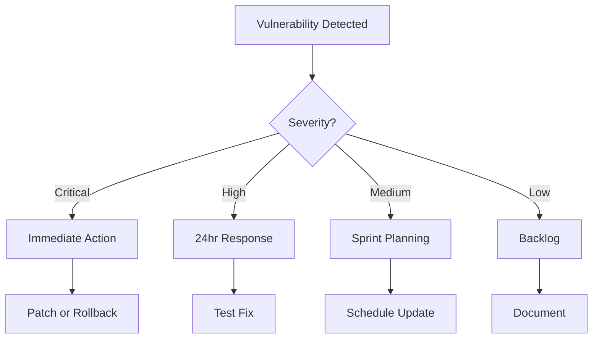

# Security Scanning Guide

## Overview

Genesis implements multi-layer security scanning for dependencies, containers, and code. This guide covers all scanning tools, workflows, and remediation procedures.

## Table of Contents
1. [Dependency Scanning](#dependency-scanning)
2. [Container Scanning](#container-scanning)
3. [Code Security](#code-security)
4. [Secret Detection](#secret-detection)
5. [Automated Workflows](#automated-workflows)
6. [Remediation Process](#remediation-process)

## Dependency Scanning

### Available Scanners

| Tool | Purpose | Severity Levels |
|------|---------|-----------------|
| Safety | Python package vulnerabilities | Critical, High, Medium, Low |
| pip-audit | OSV database scanning | CVSS scores |
| Snyk | Comprehensive vulnerability DB | Critical, High, Medium, Low |
| Dependabot | GitHub native scanning | GitHub severity |

### Running Scans

#### Using Genesis Scanner

```bash
# Run comprehensive scan
python -m genesis.security.dependency_scanner

# Include code scanning
python -m genesis.security.dependency_scanner --include-code

# Output to file
python -m genesis.security.dependency_scanner --output report.json
```

#### Individual Tools

```bash
# Safety scan
safety check --json --stdin < requirements.txt

# pip-audit scan
pip-audit --desc --format json

# Snyk scan (requires authentication)
snyk test --file=requirements.txt

# Bandit code scan
bandit -r genesis/ -f json -o bandit-report.json
```

### Vulnerability Thresholds

```python
# genesis/security/dependency_scanner.py
THRESHOLDS = {
    "critical": 0,    # No critical vulnerabilities allowed
    "high": 3,        # Maximum 3 high vulnerabilities
    "medium": 10,     # Warning above 10 medium
    "low": None       # No limit on low severity
}
```

### Scan Output Format

```json
{
  "scan_date": "2024-01-15T10:30:00Z",
  "total_packages": 150,
  "vulnerable_packages": 5,
  "summary": {
    "critical": 0,
    "high": 2,
    "medium": 5,
    "low": 8
  },
  "vulnerabilities": [
    {
      "package": "urllib3",
      "installed_version": "1.26.0",
      "vulnerability_id": "CVE-2023-45803",
      "severity": "HIGH",
      "fixed_version": "1.26.18",
      "description": "Security vulnerability in HTTP handling"
    }
  ]
}
```

## Container Scanning

### Scanning Tools

| Tool | Focus | Integration |
|------|-------|-------------|
| Trivy | OS & application vulnerabilities | GitHub Actions |
| Grype | Fast vulnerability scanner | CI/CD pipeline |
| Snyk | Container & dependencies | PR checks |
| Docker Scout | Native Docker scanning | Build time |

### Pre-Build Scanning

```bash
# Scan Dockerfile for issues
hadolint Dockerfile

# Check for best practices
docker build --check .

# Validate compose file
docker-compose config --quiet
```

### Image Scanning

```bash
# Trivy scan
trivy image genesis:prod

# With severity filter
trivy image --severity CRITICAL,HIGH genesis:prod

# Generate SBOM
trivy image --format spdx-json --output sbom.json genesis:prod

# Grype scan
grype genesis:prod

# Docker Scout
docker scout cves genesis:prod
docker scout recommendations genesis:prod
```

### Runtime Scanning

```bash
# Scan running container
docker exec genesis-trading cat /etc/os-release
trivy image --input genesis-running.tar

# Check for runtime vulnerabilities
docker run --rm \
  -v /var/run/docker.sock:/var/run/docker.sock \
  aquasec/trivy image genesis:prod
```

### CIS Benchmark Compliance

```bash
# Run Docker Bench Security
docker run --rm --net host --pid host --userns host \
  --cap-add audit_control \
  -v /var/lib:/var/lib:ro \
  -v /var/run/docker.sock:/var/run/docker.sock:ro \
  docker/docker-bench-security
```

## Code Security

### Static Analysis

```bash
# Bandit security scan
bandit -r genesis/ -ll -i -f json

# With specific checks
bandit -r genesis/ -ll \
  -t B201,B301,B302,B303,B304,B305,B306

# Exclude tests
bandit -r genesis/ -ll -x tests/
```

### Security Patterns to Detect

| Pattern | Risk | Example |
|---------|------|---------|
| `exec()` / `eval()` | Code injection | `exec(user_input)` |
| Hardcoded secrets | Credential exposure | `api_key = "abc123"` |
| SQL injection | Database compromise | `f"SELECT * FROM {table}"` |
| Weak crypto | Data exposure | `hashlib.md5()` |
| YAML unsafe load | Deserialization | `yaml.load()` |

### Custom Security Rules

```python
# .bandit
[bandit]
exclude_dirs = tests,docs
skips = B101  # Skip assert_used test
tests = B201,B301,B302,B303,B304,B305,B306,B401,B402,B403,B404,B405,B406,B407,B408,B409,B410,B411
```

## Secret Detection

### Scanning for Secrets

```bash
# TruffleHog scan
trufflehog filesystem . --json

# Gitleaks scan
gitleaks detect --source . -v

# detect-secrets scan
detect-secrets scan --baseline .secrets.baseline
```

### Pre-commit Prevention

```yaml
# .pre-commit-config.yaml
- repo: https://github.com/Yelp/detect-secrets
  hooks:
    - id: detect-secrets
      args: ['--baseline', '.secrets.baseline']
```

### Secret Patterns

```python
# Patterns to detect
SECRET_PATTERNS = [
    r'api[_-]?key.*[:=]\s*["\']?\w{20,}',
    r'secret.*[:=]\s*["\']?\w{20,}',
    r'token.*[:=]\s*["\']?\w{20,}',
    r'password.*[:=]\s*["\']?.+["\']',
    r'BEGIN RSA PRIVATE KEY',
    r'BEGIN OPENSSH PRIVATE KEY',
]
```

### Whitelisting False Positives

```json
// .secrets.baseline
{
  "exclude": {
    "files": "^tests/|^docs/",
    "lines": ".*TEST_API_KEY.*"
  },
  "allowed_secrets": [
    "docs/examples/sample_key.txt"
  ]
}
```

## Automated Workflows

### GitHub Actions

#### Dependency Scanning Workflow

```yaml
# .github/workflows/security-scan.yml
name: Security Scanning
on:
  push:
    branches: [main, develop]
  schedule:
    - cron: '0 2 * * *'

jobs:
  scan-dependencies:
    runs-on: ubuntu-latest
    steps:
      - uses: actions/checkout@v4
      - name: Run Security Scan
        run: |
          pip install safety pip-audit
          safety check
          pip-audit
```

#### Container Scanning Workflow

```yaml
# .github/workflows/container-security.yml
name: Container Security
on:
  push:
    paths:
      - 'Dockerfile'
      - 'requirements/*.txt'

jobs:
  scan-container:
    runs-on: ubuntu-latest
    steps:
      - name: Run Trivy scan
        uses: aquasecurity/trivy-action@master
        with:
          image-ref: 'genesis:${{ github.sha }}'
          format: 'sarif'
          output: 'trivy-results.sarif'
```

### Pre-commit Hooks

```bash
# Install hooks
pre-commit install

# Run all hooks
pre-commit run --all-files

# Update hooks
pre-commit autoupdate
```

### Dependabot Configuration

```yaml
# .github/dependabot.yml
version: 2
updates:
  - package-ecosystem: "pip"
    directory: "/"
    schedule:
      interval: "daily"
    open-pull-requests-limit: 5
    labels:
      - "security"
      - "dependencies"
```

## Remediation Process

### Vulnerability Assessment



### Response Procedures

#### Critical Vulnerabilities

1. **Immediate Actions:**
```bash
# Stop affected services
docker stop genesis-trading

# Check exposure
grep -r "affected_package" genesis/

# Apply patch
pip install affected_package==fixed_version

# Rebuild and test
docker build -t genesis:patched .
pytest tests/security/
```

2. **Notification:**
```bash
# Create incident
gh issue create --title "CRITICAL: CVE-2024-001 in production" \
  --label "security,critical" \
  --assignee "@security-team"
```

#### High Vulnerabilities

1. **Assessment:**
```python
# Check if exploitable
def is_exploitable(vulnerability):
    # Check if affected code path is used
    # Check if external facing
    # Check if authenticated only
    return risk_score
```

2. **Mitigation:**
```bash
# Temporary mitigation
export GENESIS_DISABLE_FEATURE=true

# Apply WAF rules
# Update security groups
# Enable additional monitoring
```

### Patch Management

#### Update Workflow

```bash
# 1. Create branch
git checkout -b security/CVE-2024-001

# 2. Update dependency
poetry add package@fixed_version
# or
pip install package==fixed_version
pip freeze > requirements.txt

# 3. Test thoroughly
pytest tests/
python -m genesis.security.dependency_scanner

# 4. Deploy to staging
docker build -t genesis:staging .
docker-compose -f docker-compose.staging.yml up

# 5. Verify fix
trivy image genesis:staging

# 6. Deploy to production
./scripts/deploy.sh production
```

#### Rollback Plan

```bash
# Tag current version
docker tag genesis:prod genesis:backup-$(date +%Y%m%d)

# If issues occur
docker tag genesis:backup-20240115 genesis:prod
docker-compose down
docker-compose up -d
```

## Security Metrics

### KPIs to Track

| Metric | Target | Measurement |
|--------|--------|-------------|
| Mean Time to Remediation (MTTR) | <24h for High | Time from detection to fix |
| Vulnerability Density | <5 per 100 packages | Vulns / Total packages |
| Patch Coverage | >95% | Patched / Total vulns |
| Scan Frequency | Daily | Automated scan runs |
| False Positive Rate | <10% | False positives / Total alerts |

### Reporting

```python
# Generate security report
def generate_security_report():
    report = {
        "date": datetime.now().isoformat(),
        "summary": {
            "total_scans": count_scans(),
            "vulnerabilities_found": count_vulnerabilities(),
            "vulnerabilities_fixed": count_fixed(),
            "critical_exposure_hours": calculate_exposure(),
        },
        "trends": {
            "weekly": get_weekly_trends(),
            "monthly": get_monthly_trends(),
        },
        "compliance": {
            "cis_benchmark": check_cis_compliance(),
            "owasp_top_10": check_owasp_compliance(),
        }
    }
    return report
```

## Best Practices

### 1. Defense in Depth

- Scan at multiple layers (code, dependencies, containers, runtime)
- Use multiple scanning tools for coverage
- Implement both preventive and detective controls

### 2. Shift Left Security

```bash
# Developer workstation
pre-commit run --all-files

# CI pipeline
pytest tests/security/

# Pre-production
trivy image genesis:staging

# Production monitoring
falco -r /etc/falco/rules.yaml
```

### 3. Security as Code

```yaml
# security-policy.yaml
policies:
  dependencies:
    max_critical: 0
    max_high: 3
    auto_update: true
  
  containers:
    max_image_size: 500MB
    require_non_root: true
    require_health_check: true
  
  code:
    forbidden_functions:
      - eval
      - exec
      - __import__
```

### 4. Continuous Monitoring

```bash
# Schedule regular scans
crontab -e
0 */6 * * * /usr/local/bin/security-scan.sh

# Monitor for new CVEs
gh api /repos/genesis/security-advisories

# Alert on threshold breach
if [ $CRITICAL_COUNT -gt 0 ]; then
  send_alert "Critical vulnerability detected"
fi
```

## Compliance

### Standards

- **CIS Docker Benchmark**: Container security baseline
- **OWASP Top 10**: Application security risks
- **PCI DSS**: If handling payment data
- **SOC 2**: Security controls

### Audit Trail

```python
# Log all security events
def log_security_event(event_type, details):
    event = {
        "timestamp": datetime.utcnow().isoformat(),
        "type": event_type,
        "details": details,
        "user": get_current_user(),
        "action_taken": details.get("action"),
        "result": details.get("result"),
    }
    
    # Write to audit log
    with open("/var/log/genesis/security-audit.log", "a") as f:
        f.write(json.dumps(event) + "\n")
    
    # Send to SIEM if configured
    if SIEM_ENABLED:
        send_to_siem(event)
```

## Next Steps

- [Incident response](incident_response.md)
- [Security hardening](hardening.md)
- [Compliance requirements](compliance.md)
- [Monitoring and alerting](../monitoring/security_monitoring.md)