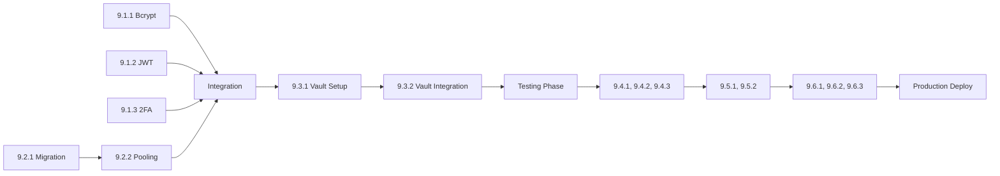

# Execution Manifest for Epic 9: Critical Security & Infrastructure Hardening

## Quick Start for Team

### Developer Assignments

**Developer 1 (Security Specialist):**
- Day 1-2: Story 9.1.1 (Bcrypt Password Hashing)
- Day 2-3: Story 9.2.2 (Connection Pooling & Partitioning)
- Day 3-4: Story 9.4.2 (WebSocket Load Testing)
- Day 4-5: Story 9.6.1 (Prometheus Metrics)

**Developer 2 (Auth & Session Expert):**
- Day 1-2: Story 9.1.2 (JWT Session Management)
- Day 2-3: Story 9.3.1 (Vault Deployment)
- Day 3-4: Story 9.4.3 (Memory Leak Detection)
- Day 4-5: Story 9.6.2 (Distributed Tracing)

**Developer 3 (Infrastructure Engineer):**
- Day 1-2: Story 9.1.3 (TOTP 2FA)
- Day 2-3: Story 9.3.2 (Vault Integration)
- Day 3-4: Story 9.5.1 (Automated Backups)
- Day 4-5: Story 9.6.3 (Alerting & SLO)

**Developer 4 (Database & Performance):**
- Day 1-2: Story 9.2.1 (PostgreSQL Migration)
- Day 2-3: Story 9.4.1 (Locust Load Testing)
- Day 3-4: Story 9.5.2 (Failover & DR)
- Day 5: Integration Testing Lead

### Worktree Creation Script

```bash
#!/bin/bash
# Run from main repository root
# This script creates all worktrees for parallel development

echo "Creating worktrees for Epic 9 parallel development..."

# Developer 1 worktrees
git worktree add -b feature/9-1-1-bcrypt ../worktree-9-1-1
git worktree add -b feature/9-2-2-pooling ../worktree-9-2-2
git worktree add -b feature/9-4-2-websocket ../worktree-9-4-2
git worktree add -b feature/9-6-1-metrics ../worktree-9-6-1

# Developer 2 worktrees
git worktree add -b feature/9-1-2-jwt ../worktree-9-1-2
git worktree add -b feature/9-3-1-vault-setup ../worktree-9-3-1
git worktree add -b feature/9-4-3-memory ../worktree-9-4-3
git worktree add -b feature/9-6-2-tracing ../worktree-9-6-2

# Developer 3 worktrees
git worktree add -b feature/9-1-3-2fa ../worktree-9-1-3
git worktree add -b feature/9-3-2-vault-integration ../worktree-9-3-2
git worktree add -b feature/9-5-1-backup ../worktree-9-5-1
git worktree add -b feature/9-6-3-alerting ../worktree-9-6-3

# Developer 4 worktrees
git worktree add -b feature/9-2-1-migration ../worktree-9-2-1
git worktree add -b feature/9-4-1-locust ../worktree-9-4-1
git worktree add -b feature/9-5-2-failover ../worktree-9-5-2

echo "All worktrees created successfully!"
echo "Developers can now navigate to their respective worktree directories."
```

### Daily Sync Points

**Day 1 Morning Standup (9:00 AM):**
- Confirm story assignments
- Review file ownership to prevent conflicts
- Establish communication channels
- Set up development environments

**Day 1 Evening Sync (5:00 PM):**
- Progress check on authentication components
- Database migration status update
- Identify any blockers

**Day 2 Morning Standup (9:00 AM):**
- Review Day 1 completions
- Start infrastructure components
- Coordinate Vault setup

**Day 2 Checkpoint (2:00 PM):**
- Authentication integration test
- Database connection pool validation
- Early integration verification

**Day 3 Morning Standup (9:00 AM):**
- Begin testing infrastructure
- Start disaster recovery implementation
- Review security components

**Day 3 Merge Window (4:00 PM):**
- Integrate completed authentication stories
- Merge database infrastructure
- Run security test suite

**Day 4 Morning Standup (9:00 AM):**
- Begin monitoring implementation
- Complete testing stories
- Start observability setup

**Day 4 Integration (3:00 PM):**
- Merge all monitoring components
- Full system integration test
- Performance validation

**Day 5 Final Integration (9:00 AM):**
- Complete system testing
- Security audit
- Production readiness validation
- Documentation review

### Critical Path Dependencies



### File Ownership Matrix

| Developer | Primary Files | No-Touch Zones |
|-----------|--------------|----------------|
| Dev 1 | `genesis/security/bcrypt_manager.py`<br>`genesis/database/connection_pool.py`<br>`tests/load/websocket_tests.py`<br>`genesis/monitoring/metrics_collector.py` | JWT files, Vault setup |
| Dev 2 | `genesis/security/jwt_manager.py`<br>`genesis/security/vault_setup.py`<br>`tests/load/memory_profiler.py`<br>`genesis/monitoring/trace_manager.py` | Bcrypt files, Database migration |
| Dev 3 | `genesis/security/totp_2fa.py`<br>`genesis/security/vault_client.py`<br>`genesis/reliability/backup_manager.py`<br>`genesis/monitoring/alert_manager.py` | JWT files, Load tests |
| Dev 4 | `genesis/database/migration_manager.py`<br>`tests/load/locust_tests.py`<br>`genesis/reliability/failover_manager.py` | Auth files, Monitoring |

### Testing Checkpoints

**Unit Test Coverage Requirements:**
- Authentication components: 100% coverage
- Database operations: 95% coverage
- Vault integration: 100% coverage
- Load testing: N/A (is test infrastructure)
- Disaster recovery: 90% coverage
- Monitoring: 85% coverage

**Integration Test Gates:**
- [ ] Auth system with all three components
- [ ] Database with connection pooling
- [ ] Vault with secret rotation
- [ ] Load test achieving 1000 TPS
- [ ] Backup and restore cycle
- [ ] Full monitoring pipeline

### Merge Strategy

1. **Feature Branch Protection:**
   - All PRs require code review
   - CI/CD must pass before merge
   - Security scan required

2. **Merge Order:**
   ```
   Day 2 EOD: 9.1.1, 9.1.2, 9.2.1
   Day 3 EOD: 9.1.3, 9.2.2, 9.3.1
   Day 4 EOD: 9.3.2, 9.4.1, 9.4.2, 9.4.3
   Day 5 AM: 9.5.1, 9.5.2
   Day 5 PM: 9.6.1, 9.6.2, 9.6.3
   ```

3. **Conflict Resolution:**
   - Main branch is source of truth
   - Conflicts resolved by story owner
   - Integration lead breaks ties

### Risk Mitigation

**Backup Plans:**
- If PostgreSQL migration fails: Continue with SQLite + optimization
- If Vault unavailable: Use encrypted env vars temporarily
- If load tests fail: Scale back performance targets
- If integration blocked: Deploy components incrementally

**Communication Escalation:**
1. Slack channel: #epic-9-security
2. Blocker escalation: Team lead within 30 minutes
3. Critical issues: CTO notification within 1 hour

### Success Criteria

**Day 1-2 Success:**
- [ ] All authentication components functional
- [ ] Database migration script tested
- [ ] Zero merge conflicts

**Day 3-4 Success:**
- [ ] Vault storing all secrets
- [ ] Load tests passing 500 TPS
- [ ] Backup system operational

**Day 5 Success:**
- [ ] Full integration complete
- [ ] All security vulnerabilities addressed
- [ ] Production deployment ready
- [ ] Documentation complete

### Post-Implementation

**Validation Checklist:**
- [ ] Security audit passed
- [ ] Performance benchmarks met
- [ ] Disaster recovery tested
- [ ] Monitoring dashboards live
- [ ] Runbooks updated
- [ ] Team trained on new systems

**Handoff Requirements:**
- Complete documentation in Confluence
- Recorded demo of new features
- Security scan results
- Performance test reports
- DR test results

### Emergency Contacts

- **Security Issues**: security-team@genesis.com
- **Database Emergency**: dba-oncall@genesis.com
- **Infrastructure**: devops@genesis.com
- **Product Owner**: po-epic9@genesis.com

### Tools & Resources

**Required Tools:**
- PostgreSQL 15+
- HashiCorp Vault 1.15+
- Locust 2.17+
- Prometheus 2.45+
- Jaeger 1.48+
- Docker & Docker Compose

**Documentation Links:**
- [PostgreSQL Migration Guide](./9.2.1.story.md)
- [Vault Setup Instructions](./9.3.1.story.md)
- [Load Testing Playbook](./9.4.1.story.md)
- [DR Procedures](./9.5.1.story.md)
- [Monitoring Setup](./9.6.1.story.md)

### Final Notes

This is a **CRITICAL** epic addressing severe security vulnerabilities. All developers must:
1. Prioritize security over speed
2. Follow secure coding practices
3. Never commit secrets to git
4. Test thoroughly before merging
5. Document all changes

**Remember**: We're handling $100k+ in production. One mistake could mean total loss of funds.

---

*Generated for Epic 9: Critical Security & Infrastructure Hardening*
*Last Updated: Epic Planning Phase*
*Total Effort: 48 hours across 4 developers*